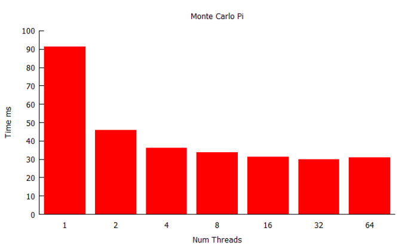

# Lab 01: Multi-threading

The aim of the first lab is to get you started with threads in C++.  We will start with CMake in different programming environments.  Once setup, we will look at different methods of thread creation: functions and lambda expressions.  We will then examine data gathering to understand parallel performance, using the Monte Carlo Pi benchmark as an example.  Then for those of you with time we will look at user-level threads with Boost.Fiber and how to use R for data analysis.

## Setting Up

### Visual Studio

### CLion

### Command Line

### Our Starting CMake File

## Starting a Thread

Creating a thread in C++ is simple - we need to include the thread header file:

```cpp
#include <thread>
```

We then create a new thread object in our application, passing in the name of the function to execute:

```cpp
thread t(hello_world);
```

This will create a new thread that will execute the function `hello_world`. The thread will start executing the function while the main application continues executing. The main application is itself a thread that is created and launched on application start.

### Waiting for a Thread to Complete

When we launch a thread we want to wait for it to complete. To do this we use the `join` method on the `thread`.

```cpp
t.join();
```

This will pause the current execution until the joined `thread` completes.

### First Multi-threaded Example

We can now create our first multi-threaded application.  This is a *Hello World* example illustrating the basics.

```cpp
#include <thread>
#include <iostream>

using namespace std ;

/*
This is the function called by the thread
*/
void hello_world()
{
    cout << "Hello from thread " << this_thread::get_id() << endl ;
}

int main(int argc, char **argv)
{
    // Create a new thread
    thread t(hello_world);
    // Wait for thread to finish (join it)
    t.join();
    // Return 0 (OK)
    return 0;
}
```

We use the following instruction:

```cpp
this_thread::get_id()
```

which gets the (operating system) assigned ID of the `thread` running.  Each time you run the application, you should get a different value.  The output of your application should be as follows:

```shell
Hello from thread 16196
```

## Multiple Tasks

When multi-threading we really want to execute multiple tasks. Creating multiple threads is easy - we just create multiple thread objects.  We will use a new operation during this next example: `sleep_for`.  It will put a `thread` to sleep for an amount of time. For example, we can put a `thread` to sleep for 10 seconds.

```cpp
sleep_for(seconds(10));
```

The `chrono` header provides access to the duration constructs.

```cpp
#include <chrono>
```

Below is a multiple task test application:

```cpp
#include <thread>
#include <chrono>
#include <iostream>

using namespace std;
using namespace std::chrono;
using namespace std::this_thread;

void task_one()
{
    cout << "Task one starting" << endl;
    cout << "Task one sleeping for 3 seconds" << endl;
    sleep_for(seconds(3));
    cout << "Task one awake again" << endl;
    cout << "Task one sleeping for 5 seconds" << endl;
    sleep_for(milliseconds(5000));
    cout << "Task one awake again" << endl;
    cout << "Task one ending" << endl;
}

void task_two()
{
    cout << "Task two starting" << endl;
    cout << "Task two sleeping for 2 seconds" << endl;
    sleep_for(microseconds(2000000));
    cout << "Task two awake again" << endl;
    cout << "Task two sleeping for 10 seconds" << endl;
    sleep_for(seconds(10));
    cout << "Task two awake again" << endl;
    cout << "Task two ending" << endl;
}

int main(int argc, char **argv)
{
    cout << "Starting task one" << endl;
    thread t1(task_one);
    cout << "Starting task two" << endl;
    thread t2(task_two);
    cout << "Joining task one" << endl;
    t1.join();
    cout << "Task one joined" << endl;
    cout << "Joining task two" << endl;
    t2.join();
    cout << "Task two joined" << endl;
    cout << "Exiting" << endl;
    return 0;
}
```

This application has been designed to show the different time constructs and show multiple tasks interleaving.  The output from this application is:

```shell
Starting task one
Starting task two
Task one starting
Task one sleeping for 3 seconds
Joining task one
Task two starting
Task two sleeping for 2 seconds
Task two awake again
Task two sleeping for 10 seconds
Task one awake again
Task one sleeping for 5 seconds
Task one awake again
Task one ending
Task one joined
Joining task two
Task two awake again
Task two ending
Task two joined
Exiting
```

## Passing Parameters to Threads

We can now create threads in C++ and put them to sleep. Next we are going to pass parameters to a `thread`. It just requires adding the parameters to the `thread` creation call. For example, the following function:

```cpp
void task(size_t n, int val)
```

we can create a `thread` and pass in parameters to `n` and `val` as follows:

```cpp
thread t(task, 1, 20);
```

`n` will be assigned 1 and `val` will be assigned 10. We will use random number generation to set these values.

### Random Numbers in C++

To use random numbers we need to include the `random` header

```cpp
#include <random>
```

We then create a random number generation engine. There are several generation engines, but we will use the default. We create this as follows:

```cpp
default_random_engine e(seed);
```

`seed` is a value used to seed the random number engine.  You should, hopefully, know that we cannot truly create random numbers so a `seed` defines the sequence.  The same `seed` will produce the same sequence of random numbers.  We will available random hardware (if present) to generate our `seed`. To get a random number from the engine we call it:

```cpp
auto num = e();
```

### Ranged `for` Loops

The other new functionality we will use is a ranged `for` loop. You may be familiar with the `foreach` loop in C#. The ranged `for` loop in C has the same functionality:

```cpp
for (auto &t : threads)
```

We use `t` as an object reference in our loop. The `threads` variable is a collection.

### Test Application

Our test application will create 100 threads.  Each `thread` will print out an index and a random number.  The threads will be stored in a `vector` so we can
`join` them all.  Our test application is:

```cpp
#include <thread>
#include <iostream>
#include <vector>
#include <random>
#include <chrono>

using namespace std;
using namespace std::chrono;

constexpr size_t num_threads = 100;

void task(size_t n , int val)
{
    cout << "Thread: " << n << " Random Value: " << val << endl;
}

int main(int argc, char **argv)
{
    // C++ style of creating a random
    // Seed with real random number if available
    std::random_device r;
    // Create random number generator
    default_random_engine e(r());

    // Create 100 threads in a vector
    vector<thread> threads;
    for (size_t i = 0; i < num_threads; ++i)
        threads.push_back(thread(task, i, e()));

    // Use C++ ranged for loop to join the threads
    // Same as foreach in C#
    for (auto &t : threads)
        t.join();

    return 0;
}
```

Running the application gives the following:

```shell
...
Thread: 89 Random Value: 1293822889
Thread: 90 Random Value: 2009369548
Thread: 92 Random Value: 1945950277
Thread: 93 Random Value: 1557845376
Thread: 94 Random Value: 586610208
Thread: 95 Random Value: 60342479
Thread: 96 Random Value: 563763169
Thread: 97 Random Value: 469730819
Thread: 98 Random Value: 615988561
Thread: 99 Random Value: 2048566187
```

## Lambda (λ)-Expressions

Lambda (λ)-expressions are becoming popular in object-oriented languages. λ-expressions come from functional languages, e.g. F#, Haskell, etc.  They allow function objects which we can apply parameters to and get a result.

### What is a λ-Expression

A λ-expression is essentially a function.  However, it has some properties that allow us to manipulate the function. For example, if we define a function as follows:

```
add(x, y) = x + y
```

We can use this function object to create a new function object that adds 3 to any parameter:

```
add3(y) = add(3)
```

We can then use the `add3` function as a new function. We can get the results as follows:

```
add(10, 5) = 15
add3(10) = 13
add(2, 0) = 2
add4(y) = add(4)
add4(6) = 10
```

### λ-Expressions in C++

One advantage of C++ λ-expressions is they allow us to create functions with fewer lines of code.  Traditionally, we would create a function/method definition with parameters and return type. In C++, we can simplify this. For example, we can create an `add` function:

```cpp
auto add = [](int x , int y) { return x + y; };
```

The `[]` block allows parameter passing into the function. We define the parameters we want to pass to the function. Finally, in the curly brackets, we define the $\lambda$ expression. We can use the `add` as a normal function:

```cpp
auto x = add(10, 12);
```

### Example Application

We will look at a collection of different ways to use λ-expressions in C++.  We are brushing the surface of λ-expressions here, but it is enough for what
we need.

#### Simple λ-Expression Example

We have already looked at the add example:

```cpp
// Create lambda expression
auto add = [](int x , int y){ return x + y; };
// Call the defined function
auto x = add (10 , 12);
// Display answer - should be 22
cout << "10 + 12 = " << x << endl;
```

This is the simplest form of $\lambda$-expression in C++. We use `auto` so the compiler will work out the type.

#### Function Objects

Another method is to create a `function` object.  For this, we need to include the `functional` header:

```cpp
#include <functional>
```

We can then create a `function` object:

```cpp
// Create function object with same lambda expression
function<int(int, int)> add_function = [](int x, int y){ return x + y; };
// Call the function object
x = add_function(20, 12);
// Display the answer - should be 32
cout << "20 + 12 = " << x << endl;
```

This is the same add example, except we are defining the type of the `function`.

#### Fixed Values

We already mentioned that we can pass fixed values within the square brackets `[ ]`:

```cpp
int a = 5;
int b = 10;
// Define the values passed to the function
auto add_fixed = [a, b]{ return a + b; };
// Call the function
x = add_fixed();
// Display the answer - should be 15
cout << "5 + 10 = " << x << endl;
```

If we change the values of `a` and `b`, the output of `add_fixed` does not change. So, if we do the following:

```cpp
// Change the values of a and b
a = 20; b = 30;
// Call the fixed function again
x = add_fixed();
// Display the answer - will come out as 15
cout << " 20 + 30 = " << x << endl;
```

The output of `add_fixed` will still be 15, not 50.

#### Reference Values

Although not a good practice, we can pass values to the function as references.  We can change the function definition:

```cpp
// Define the values passed to the function, but pass as a reference
auto add_reference = [&a, &b]{ return a + b; };
// Call the function
x = add_reference();
// Display the answer - should be 50
cout << "20 + 30 = " << x << endl;
// Change values of a and b
a = 30;
b = 5;
// Call the reference based function again
x = add_reference();
// Display the answer - should be 35
cout << "30 + 5 = " << x << endl;
```

Note the use of `&` to denote we are passing by reference. When we change the values of `a` and `b` now the output of the function is also changed.

#### Complete Application

The complete λ-expression application is given below:

```cpp
#include <iostream>
#include <functional>

using namespace std;

int main (int argc, char **argv)
{
    // Create lambda expression
    auto add = [](int x, int y) { return x + y; };
    // Call the defined function
    auto x = add(10 , 12);
    // Display answer - should be 22
    cout << "10 + 12 = " << x << endl;

    // Create function object with same lambda expression
    function<int(int, int)> add_function = [](int x, int y) { return x + y; };
    // Call the function object
    x = add_function(20, 12);
    // Display the answer - should be 32
    cout << "20 + 12 = " << x << endl;

    int a = 5;
    int b = 10;
    // Define the values passed to the function
    auto add_fixed = [a, b] { return a + b; };
    // Call the function
    x = add_fixed();
    // Display the answer - should be 15
    cout << "5 + 10 = " << x << endl;

    // Change values of a and b
    a = 20;
    b = 30;
    // Call the fixed function again
    x = add_fixed();
    // Display the answer - will come out as 15
    cout << "20 + 30 = " << x << endl;

    // Define the values passed to the function , but pass as reference
    auto add_reference = [&a, &b] { return a + b; };
    // Call the function
    x = add_reference();
    // Display the answer - should be 50
    cout << "20 + 30 = " << x << endl;

    // Change the values of a and b
    a = 30;
    b = 5;
    // Call the reference based function again
    x = add_reference();
    // Display the answer - should be 35
    cout << "30 + 5 = " << x << endl;

    return 0;
}
```

The output is:

```shell
10 + 12 = 22
20 + 12 = 32
5 + 10 = 15
20 + 30 = 15
20 + 30 = 50
30 + 5 = 35
```

## λ-Expressions and Threads

We can use λ-expressions to create threads.  Our hello world thread application using λ-expressions is:

```cpp
#include <thread>
#include <iostream>

using namespace std;

int main(int argc, char **argv)
{
    // Create a thread using a lambda expression
    thread t([]{ cout << "Hello from lambda thread!" << endl; });
    // Join thread
    t.join();

    return 0;
}
```

It is that simple. For the rest of the module, it is up to you whether you use λ-expressions or not. We will work interchangeably, and there is no effect on your grades for your choice.

## Gathering Data

Throughout the module, we will gather data to analyse the performance of our applications.  The key metrics in parallel performance are *speed up* and *efficiency*. Our method will be to output timing data into a comma separated value (.csv) file. CSV files can be loaded into Excel, R or other data analysis tools, and thereby generate a chart. In our first application, we will get the average of 100 iterations of a simple task that will just spin the processor.

### Work Function

Our work function is below:

```cpp
void work()
{
    // Do some spinning - no actual processing but will make the CPU work
    int n = 0;
    for (int i = 0; i < 1000000; ++i)
        ++n;
}
```

The work is to increment a value 1 million times. This won't take much time for the processor.

### Creating a File

To create an output file in C++ we use the following:

```cpp
ofstream data("data.csv", ofstream::out);
```

An output file called `data.csv` will be created which we can write to.  Filestreams are just normal output streams like `cout`.

### Capturing Times

The `system_clock` type allows time capture in C++. Timing requires the *start* and *end* of an experiment from which we calculate the *duration*.  Timing data will be in *nanoseconds* (ns).

```cpp
// Get start time
auto start = system_clock::now();
// ... do some work
// Get end time
auto end = system_clock::now();
// Calculate total time
auto total = end - start;
// Output total time in ms to the file
data << total.count() << endl;
```

### Complete Application

Our complete application is below:

```cpp
#include <thread>
#include <chrono>
#include <iostream>
#include <fstream>

using namespace std;
using namespace std::chrono;

void work ()
{
    // Do some spinning - no actual processing but will make the CPU work
    int n = 0;
    for (int i = 0; i < 1000000; ++i)
        ++n;
}

int main(int argc, char **argv)
{
    // Create a new file
    ofstream data("data.csv", ofstream::out);
    // We’re going to gather 100 readings , so create a thread and join it 100 times
    for (int i = 0; i < 100; ++i)
    {
        // Get start time
        auto start = system_clock::now();
        // Start thread
        thread t (work);
        t.join();
        // Get end time
        auto end = system_clock::now();
        // Calculate the duration
        auto total = end - start;
        // Write to file
        data << total.count() << endl;
    }
    // 100 iterations complete.
    data.close();
    return 0;
}
```

### Getting the Data

Once the application is complete you will have a `.csv` file which you should open with Excel. Get the mean of the 100 stored values.  You also need to document the specification of your machine. This is important information. For example, the result from my test is 270000ns and hardware I ran the experiment on was:

* **CPU** Intel i5-2500 @ 3.3GHz
* **Memory** 8GB
* **OS** Windows 10 64bit
* **Compiler** MSVC 15

As we progress through the module, we will find that the other pieces of information about your machine will become useful.

## Monte Carlo Pi

Our first case study will approximate π using a Monte Carlo method. A Monte Carlo method uses random number to compute a value. Because we can increase the number of random values generated to improve the quality of the result we can scale the number of computations. This will allow us to perform a test that we can push our CPU.

### Theory

The theory behind calculating π using a Monte Carlo method is best described using an image.

 **Sourced from Wikimedia Commons**


The radius of the circle is defined as `r`. The area of a circle is calculated as:

```alg
πr<sup>2</sup>
```

As the square surrounding the circle as side lengths of 2π we can calculate the area of the square:

```alg
4r<sup>2</sup>
```

Suppose that `r=1`. If we pick a random point within the square, we can determine whether it is in the circle by calculating the distance of the point from the centre of the square. If this is 1 or less, the point is within the circle. If it is greater than 1, then it is in the square but not the circle. The ratio of total random points to ones in the circle allows us to approximate π. This is because:

```alg
Area circle = πr <sup>2</sup>
Area square = π4 <sup>2</sup>
Ratio = πr <sup>2</sup>/π4 <sup>2</sup>
```

We can create an algorithm to approximate π as:

```alg
attempts = N
in_circle = M
ratio = M/N
π/4 ≈ M/N
π ≈ 4 * M/N
```

Generating random points therefore allows an approximation of π. Points range from `[(0.0, 0.0), (1.0, 1.0)]`, and calculating the distance `(0, 0)` determines if the point is in the circle.

### Distribution of Random Numbers

Before looking at a C++ implementation of Monte Carlo $\pi$, we need to random number distributions. A distribution defines the type and range of values we get from a random engine. There are a few distribution types - here we will be use a [uniform real distribution](http://www.cplusplus.com/reference/random/uniform_real_distribution/).  We also require a range from 0.0 to 1.0.

```cpp
// Create a distribution
uniform_real_distribution<double> distribution(0.0, 1.0);
// Use this to get a random value from our random engine e
auto x = distribution(e);
```

### Monte Carlo Pi Algorithm

Our algorithm implementation in C++ is below:

```cpp
void monte_carlo_pi(size_t iterations)
{
    // Seed with real random number if available
    std::random_device r;
    // Create random number generator
    default_random_engine e(r());
    // Create a distribution - we want doubles between 0.0 and 1.0
    uniform_real_distribution<double> distribution(0.0, 1.0);

    // Keep track of number of points in circle
    unsigned int in_circle = 0;
    // Iterate
    for (size_t i = 0; i < iterations; ++i)
    {
        // Generate random point
        auto x = distribution(e);
        auto y = distribution(e);
        // Get length of vector defined - use Pythagarous
        auto length = sqrt((x * x) + (y * y));
        // Check if in circle
        if (length <= 1.0)
            ++in_circle;
    }
    // Calculate pi
    auto pi = (4.0 * in_circle) / static_cast<double>(iterations);
}
```

Notice we are not returning the value for $\pi$ - you can print to test the accuracy. We will look at how we can get the result from a task in later tutorials.

### Main Application

We are going to capture the amount of time it takes to perform $2^{24}$ iterations of the Monte Carlo $\pi$ calculation.  We are also going to spread the work across a varying number of threads based on the powers of 2.
The following table will explain how this works.

| **Number of Threads** | **Iterations** | **Iterations per Thread** |
| --------------------- | -------------- | ------------------ |
| $2^0=1$ | $2^{24}$ | $\frac{2^{24}}{2^0}=2^{24}$ |
| $2^1=2$ | $2^{24}$ | $\frac{2^{24}}{2^1}=2^{23}$ |
| $2^2=4$ | $2^{24}$ | $\frac{2^{24}}{2^2}=2^{22}$ |
| $2^3=8$ | $2^{24}$ | $\frac{2^{24}}{2^3}=2^{21}$ |
| $2^4=16$ | $2^{24}$ | $\frac{2^{24}}{2^4}=2^{20}$ |
| $2^5=32$ | $2^{24}$ | $\frac{2^{24}}{2^5}=2^{19}$ |
| $2^6=64$ | $2^{24}$ | $\frac{2^{24}}{2^6}=2^{18}$ |

Using powers of 2 when performing computation experiments is the norm.  It also us to test multi-core configurations (e.g. dual, quad, etc.). This means we will test for the configuration for your own computer.

The main application code is defined below:

```cpp
int main(int argc, char **argv)
{
    // Create data file
    ofstream data("montecarlo.csv", ofstream::out);

    for (size_t num_threads = 0; num_threads <= 6; ++num_threads)
    {
        auto total_threads = static_cast<unsigned int>(pow(2.0, num_threads));
        // Write number of threads
        cout << "Number of threads = " << total_threads << endl;
        // Write number of threads to the file
        data << "num_threads_" << total_threads;
        // Now execute 100 iterations
        for (size_t iters = 0; iters < 100; ++iters)
        {
            // Get the start time
            auto start = system_clock::now();
            // We need to create total_threads threads
            vector<thread> threads;
            for (size_t n = 0; n < total_threads; ++n)
                // Working in base 2 to make things a bit easier
                threads.push_back(thread(monte_carlo_pi, static_cast<unsigned int>(pow(2.0, 24.0 - num_threads))));
            // Join the threads (wait for them to finish)
            for (auto &t : threads)
                t.join();
            // Get the end time
            auto end = system_clock::now();
            // Get the total time
            auto total = end - start;
            // Convert to milliseconds and output to file
            data << ", " << duration_cast<milliseconds>(total).count();
        }
        data << endl;
    }
    // Close the file
    data.close();
    return 0;
}
```

You will need the relevant include files and using statements. Once you have run the application, you will get another `.csv` file.

### Results

You should record your results and the hardware configuration you used. For example:

| **Number of Threads** | **Iterations** | **Iterations per Thread** | **Time ms** |
| ----- | ----- | ----- | -----|
| \[2^0=1\] | $2^{24}$ | $\frac{2^{24}}{2^0}=2^{24}$ | 91.32 |
| $2^1=2$ | $2^{24}$ | $\frac{2^{24}}{2^1}=2^{23}$ | 45.8  |
| $2^2=4$ | $2^{24}$ | $\frac{2^{24}}{2^2}=2^{22}$ | 35.96 |
| $2^3=8$ | $2^{24}$ | $\frac{2^{24}}{2^3}=2^{21}$ | 33.64 |
| $2^4=16$ | $2^{24}$ | $\frac{2^{24}}{2^4}=2^{20}$ | 31.07|
| $2^5=32$ | $2^{24}$ | $\frac{2^{24}}{2^5}=2^{19}$ | 29.78|
| $2^6=64$ | $2^{24}$ | $\frac{2^{24}}{2^6}=2^{18}$ | 30.92|

Notice my best time levels out at around 4 to 8 threads. The processor used was a quad core. Notice as well that performance actually starts to drop as the number of threads increases. This is due to threads (in particular switching threads on cores) have an overhead. The more threads you create, the greater the overhead.

We can also produce a bar chart to illustrate the results (e.g. via Excel).



**You are expected to gather timing results and produce tables and charts as shown in this tutorial.** You should keep a logbook of some form to do this.

## If you have time - User-level Threads with Boost.Fibers

Boost provides user-level (i.e., lightweight) threads.  These provide faster context switching on a single core, although the scheduler can work with multiple cores.

The Boost.Fibers API interface looks almost exactly the same as C++ threads.  Your task here is to try and replicate the experiments here using Boost.Fibers to see the difference in performance.  Details on Boost.Fibers is available [here](https://www.boost.org/doc/libs/1_67_0/libs/fiber/doc/html/index.html).

## If you have time - Using R to Analyse Data

Although Excel can produce reasonable charts, it is better to write a small R script that will extract the data, calculate the necessary metrics, and produce the charts.  If you have time, try and write this R script - it will make your life easier.

Alternatively look into Python for the same purpose.

## Exercises

These exercises are designed to test your understanding and capabilities
in what we have covered so far. As such, they will take time to
complete.

1.  Create an application that will first generate 10 million random
    numbers and store them in a vector. Your task is now to find the
    maximum and minimum values in the vector. As with Monte Carlo $\pi$,
    time the application using different thread configurations. You
    should also determine some method to store the maximum and minimum
    values and thus display it. As your first run will use one thread
    you can test that each different configuration returns the correct
    maximum and minimum.

2.  Write an application that will multiply a matrix of dimensions
    $1000 \times 1000$ by a vector with 1000 components. If you do not
    remember how we perform a matrix-vector multiplication, remember
    that each component of the resulting 1000 component vector is
    calculated as follows (assuming 0-indexing):
    $$y_i = \sum\limits_{j=0}^{999} a_{ij}x_j$$ If you are unsure about
    how to do the calculation then do some research into matrix
    multiplication.

3.  Modify the Monte Carlo π test to use a $\lambda$ expression instead.
    This is relatively easy once you understand $\lambda$ expressions.
    Again, gather timing data as before and see if there is any
    difference in performance.

4.  Some of the timings you are gathering will sometimes come out at
    0ms. A possible solution is the `high_resolution_clock` and taking
    the timings in microseconds (abbreviated $\mu$s). Change the Monte
    Carlo $\pi$ application to use these techniques to get a finer
    grained analysis.

## Reading

The reading after each tutorial is very important. It will cement your understanding of the material covered thus far.

This week, you should read chapters 1 and 2 of C++ Concurrency in Action.
