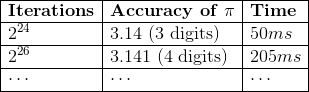

# Controlling Multi-threaded Applications

In the last tutorial we looked at thread creation. In this tutorial, we will look at thread control. Control of multi-threaded applications is important due to the problems encountered with shared memory. However, controlling multi-threaded applications also leads to problems. The control of multi-threaded applications is where the concept of concurrency comes in.

The second half of the tutorial will look at other control concepts - atomics and futures. Atomics are a method of non-blocking control of shared values. Futures enable spinning off work and getting the result later.

## Shared Memory Problems

First we will show why shared memory is a problem when dealing with multi-threaded applications. We will build a simple application which increments a shared value. The example is somewhat contrived, but illustrates the problem.

### Shared Pointers in C++

Smart pointers have made C++ programming easier as we no longer have to worry about memory management (well - not as much anyway). In this example, we will use a `shared_ptr`. A `shared_ptr` is a pointer that is reference counted. That means every time you create a copy of the pointer a counter is incremented. Every time the pointer goes out of scope the counter is decremented. When the counter hits 0 the memory allocated is automatically freed. This does have a (very slight) overhead, but generally makes life easier.

For this example, we will use `make_shared` which calls the constructor for the defined type based on the parameters passed. For example, we can create a shared integer as follows:

```cpp
auto value = make_shared<int>(0);
```

The type of `value` (automatically determined by the compiler) is `shared_ptr<int>`. We can share `value` by passing it as a parameter.

To use smart pointers, we need the `memory` header:

```cpp
#include <memory>
```

### Application

Our application is quite simple - it will increment `value`:

```cpp
void increment(shared_ptr<int> value)
{
    // Loop 1 million times, incrementing value
    for (unsigned int i = 0; i < 1000000; ++i)
        // Increment value
        *value = *value + 1;
}
```

Notice we dereference the pointer (via `*value`) to get the value stored in the `shared_ptr`, add 1 to `value` and set the `shared_ptr`. The main application is:

```cpp
int main(int argc, char **argv)
{
    // Create a shared int value
    auto value = make_shared<int>(0);

    // Create number of threads hardware natively supports
    auto num_threads = thread::hardware_concurrency();
    vector<thread> threads;
    for (unsigned int i = 0; i < num_threads; ++i)
        threads.push_back(thread(increment, value));

    // Join the threads
    for (auto &t : threads)
        t.join();

    // Display the value
    cout << "Value = " << *value << endl;
}
```

`thread::hardware_concurrency` is the number of threads your hardware natively supports. As increment adds 1 million to the shared value, depending on your hardware configuration you might expect a printed value of 1 million, 2 million, 4 million (maybe even 8 million). But my run gave:

```shell
Value = 2151345
```

I lost almost 2 million increments. So where did they go?

This is the shared resource problem called a **race-condition**. We do not know which order the threads are accessing the resource. For example a four thread application could do this:

  | **Time** | **Thread 0** | **Thread 1** | **Thread 2** | **Thread 3** | **Value** |
  |----------|--------------|--------------|--------------|--------------|-----------|
  |    1     |    Get (0)   |              |              |              |  0        |
  |    2     |    Add (1)   |     Get (0)  |      Get (0) |              |  0        |
  |    3     |   Store (1)  |     Add (1)  |      Add (1) |  Get (0)     |  1        |
  |    4     |    Get (1)   |    Store (1) |              |  Add (1)     |  1        |
  |    5     |              |     Get (1)  |              |  Store (1)   |  1        |
  |    6     |    Add (2)   |              |      Get (1) |              |  1        |
  |    7     |   Store (2)  |     Add (2)  |              |  Get (1)     |  2        |
  |    8     |              |    Store (2) |      Add (1) |              |  2        |
  |    9     |              |              |    Store (2) | Add (2)      |  2        |
  |    10    |              |              |              | Store (2)    |  2        |

Each thread has incremented the value twice (you can check) and the value should be 8.  But the actual value is 2. Each thread is competing for the resource. This is called a **race-condition** (or race-hazard) as behaviour depends on which thread gets to the resource first - which thread wins the race. Races are an important concept to grasp and you need to understand that sharing resources in multi-threaded applications is inherently dangerous if you do not add some control.

## Mutex

To control shared memory we can use a **mutex**. A mutex (mutual-exclusion) guards sections of code so that only one thread can operate within it at a time. If we share the mutex in some manner then we can have different sections of code protected by a single mutex, ensuring only one thread can enter these sections at once.

To use a mutex in C++ we include the `mutex` header:

```cpp
#include <mutex>
```

We need a `mutex` as a global variable for our program:

```cpp
mutex mut;
```

We can now update `increment` to use the mutex. `mutex` provides two methods: `lock` (to claim unique ownership) and `unlock` (to release ownership). Any thread attempting to lock the mutex must wait until the mutex is unlocked and it successfully acquires the lock.  There might be a queue of waiting threads.

The updated `increment` function is:

```cpp
void increment(shared_ptr<int> value)
{
    // Loop 1 million times, incrementing value
    for (unsigned int i = 0; i < 1000000; ++i)
    {
        // Acquire the lock
        mut.lock();
        // Increment value
        *value = *value + 1;
        // Release the lock
        mut.unlock();
    }
}
```

If you run this version of your application it is slower but the result is as expected. For example, I get 

```shell
Value = 4000000
```

## Lock Guards

Forgetting to lock and unlock a mutex can cause problems can make code difficult to follow. Other problems include methods with multiple exit points (including exceptions) which requires unlocking at all possible points. Due to C++'s object deconstruction at scope exit we can use a `lock_guard` to automatically manage a `mutex`.

Using a `lock_guard` is simple. A change to the increment function is below:

```cpp
void increment(shared_ptr<int> value)
{
    // Loop 1 million times, incrementing value
    for (unsigned int i = 0; i < 1000000; ++i)
    {
        // Create the lock guard - automatically acquires mutex
        lock_guard<mutex> lock(mut);
        // Increment value
        *value = *value + 1;
        // lock guard is automatically destroyed at the end of the loop scope
        // This will release the lock
    }
}
```

Mutexes and lock guards provide the simplest method of protecting shared resources. However, their simplicity leads to other problems, such as **deadlock**, which we need to overcome.

## Condition Variables

A limitation of mutexes is that we are only controlling access shared resources. You can think of it as having a gate. We let one person in through the gate at any one time, and do not let anyone else enter until that person has left.  We have no control over what happens outside the gate where arguments over who is next in line may occur.

Another approach is waiting for a signal. We could wait until the signal is activated and then carry on doing some work. This is a technique using a **semaphore**.

Consider a set of traffic lights at a crossroads. We have two streams of traffic that wish to use the intersection at the same time. By having a set of lights we control access to the crossroads.  A semaphore, or in C++ a condition variable, allows controlled access similar to a set of traffic lights at a crossroads.

### Using Condition Variables

To use condition variables we include the `condition_variable` header:

```cpp
#include <condition_variable>
```

A condition variable has three operations of interest. First, `wait`:

```cpp
condition.wait(lock);
```

This will cause a `thread` to wait until a signal has been received.  We have to pass a lock to the `wait` method to ensure we wait on the correct mutex.

The next method is `notify_one`:

```cpp
condition.notify_one();
```

This will notify one thread currently waiting on the condition variable. There is a similar method called `notify_all` which will signal all waiting threads.

The final method is `wait_for`:

```cpp
if (condition.wait_for(lock, seconds(3)) == cv_status::no_timeout)
```

`wait_for` returns a `timeout` or `no_timeout` value. If the thread is notified before the time runs out, then `wait_for` returns `no_timeout`. Otherwise, it returns `timeout`. There is a similar method called `wait_until` which allows you to wait until an absolute timepoint.

### Application

We will create two threads which wait and signal each other, allowing interaction between the threads. Our first thread runs the following:

```cpp
void task_1(condition_variable &condition)
{
    // Task one will initially sleep for a few seconds
    cout << "Task 1 sleeping for 3 seconds" << endl;
    this_thread::sleep_for(seconds(3));
    // Create lock - thread 2 should manged to grab it first
    auto lock = unique_lock<mutex>(mut);
    // Notify waiting thread
    cout << "Task 1 notifying waiting thread" << endl;
    condition.notify_one();
    // Now wait for notification
    cout << "Task 1 waiting for notification" << endl;
    // Wait, freeing lock as we do.
    condition.wait(lock);
    // We are free to continue
    cout << "Task 1 notified" << endl;
    // Sleep for 3 seconds
    cout << "Task 1 sleeping for 3 seconds" << endl;
    this_thread::sleep_for(seconds(3));
    // Notify any waiting thread
    cout << "Task 1 notifying waiting thread" << endl;
    condition.notify_one();
    // Now wait 3 seconds for notification
    cout << "Task 1 waiting 3 seconds for notification" << endl;
    if (condition.wait_for(lock, seconds(3)) == cv_status::no_timeout)
        cout << "Task 1 notified before 3 seconds" << endl;
    else
        cout << "Task 1 got tired waiting" << endl;
    // Print finished message
    cout << "Task 1 finished" << endl;
}
```

Our second thread will run the following code:

```cpp
void task_2(condition_variable &condition)
{
    // Create lock
    auto lock = unique_lock<mutex>(mut);
    // Task two will initially wait for notification
    cout << "Task 2 waiting for notification" << endl;
    // Wait, releasing the lock as we do.
    condition.wait(lock);
    // We are free to continue
    cout << "Task 2 notified" << endl;
    // Sleep for 5 seconds
    cout << "Task 2 sleeping for 5 seconds" << endl;
    this_thread::sleep_for(seconds(5));
    // Notify waiting thread
    cout << "Task 2 notifying waiting thread" << endl;
    condition.notify_one();
    // Now wait 5 seconds for notification
    cout << "Task 2 waiting 5 seconds for notification" << endl;
    if (condition.wait_for(lock, seconds(5)) == cv_status::no_timeout)
        cout << "Task 2 notified before 5 seconds" << endl;
    else
        cout << "Task 2 got tired waiting" << endl;
    // Sleep for 5 seconds
    cout << "Task 2 sleeping for 5 seconds" << endl;
    this_thread::sleep_for(seconds(5));
    // Notify any waiting thread
    cout << "Task 2 notifying waiting thread" << endl;
    condition.notify_one();
    // Print finished message
    cout << "Task 2 finished" << endl;
}
```

Finally, our main application is:

```cpp
int main(int argc, char **argv)
{
    // Create condition variable
    condition_variable condition;

    // Create two threads
    thread t1(task_1, ref(condition));
    thread t2(task_2, ref(condition));

    // Join two threads
    t1.join();
    t2.join();

    return 0;
}
```

Note the use `ref`. This is how we create a reference to pass to our thread functions. The interactions between these threads have been organised so that you will get the following output:

```shell
Task 1 sleeping for 3 seconds
Task 2 waiting for notification
Task 1 notifying waiting thread
Task 1 waiting for notification
Task 2 notified
Task 2 sleeping for 5 seconds
Task 2 notifying waiting thread
Task 2 waiting 5 seconds for notification
Task 1 notified
Task 1 sleeping for 3 seconds
Task 1 notifying waiting thread
Task 1 waiting 3 seconds for notification
Task 2 notified before 5 seconds
Task 2 sleeping for 5 seconds
Task 2 notifying waiting thread
Task 2 finished
Task 1 got tired waiting
Task 1 finished
```

## Guarded Objects

Now that we know how to protect sections of code, and how to signal threads, we can build protected code in an object-oriented manner. We will modify `increment` so an object controls the counter. First we need a header file (`guarded.h`):

```cpp
#include <mutex>

class guarded
{
private:
    std::mutex mut;
    int value;
public:
    guarded() : value(0) { }
    ~guarded() { }
    int get_value() const { return value; }
    void increment();
};
```

We provide the object with its own `mutex`. This is to protect access to our value, and is how both C# and Java naturally protect objects. We use a `lock_guard` to control the increment method. This goes in our C++ file (`guarded.cpp`):

```cpp
#include "guarded.h"

void guarded::increment()
{
    std::lock_guard<std::mutex> lock(mut);
    int x = value;
    x = x + 1;
    value = x;
}
```

The method is contrived to force multiple operations within the method. Finally, our main method is:

```cpp
#include <iostream>
#include <memory>
#include <thread>
#include <vector>
#include "guarded.h"

using namespace std;

constexpr unsigned int NUM_ITERATIONS = 1000000;
constexpr unsigned int NUM_THREADS = 4;

void task(shared_ptr<guarded> g)
{
    // Increment guarded object NUM_ITERATIONS times
    for (unsigned int i = 0; i < NUM_ITERATIONS; ++i)
        g->increment();
}

int main(int argc, char **argv)
{
    // Create guarded object
    auto g = make_shared<guarded>();

    // Create threads
    vector<thread> threads;
    for (unsigned int i = 0; i < NUM_THREADS; ++i)
        threads.push_back(thread(task, g));
    // Join threads
    for (auto &t : threads)
        t.join();

    // Display value stored in guarded object
    cout << "Value = " << g->get_value() << endl;

    return 0;
}
```

Your output window should state that value equals 4 million. The use of a `lock_guard` and an object level `mutex` is the best method to control access to an object. They ensure that methods are called when permitted by competing threads.

## Thread Safe Data Structures

To end the first part of this tutorial, we will implement a thread safe stack. Shared data structures are susceptible to multi-threading problems. This example is modified from C++ Concurrency in Action.

### Overview

A stack has values which we can add to the top (`push`) or remove from the top of (`pop`). Our implementation will be primitive, wrapping a standard stack in an object with thread safe operations.

First we need a new header file called `threadsafe_stack.h`:

```cpp
#pragma once

#include <exception>
#include <stack>
#include <memory>
#include <mutex>

template<typename T>
class threadsafe_stack
{
private:
    // The actual stack object we are using
    std::stack<T> data;
    // The mutex to control access
    mutable std::mutex mut;
public:
    // Normal constructor
    threadsafe_stack() { }
    // Copy constructor
    threadsafe_stack(const threadsafe_stack &other)
    {
        // We need to copy the data from the other stack.  Lock other stack
        std::lock_guard<std::mutex> lock(other.mut);
        data = other.data;
    }
```

Notice that we have a copy constructor. When it is copying it must lock the other stack to ensure its copy is correct. Also note the use of the keyword `mutable`. This keyword indicates that the `mutex` can be modified in `const` methods where normally we do not mutate an object's state. This is a convenience as our `mutex` does not affect the class data, but we still want to have `const` methods.

### Push

`push` needs to lock the stack for usage:

```cpp
// Push method.  Adds to the stack
void push(T value)
{
    // Lock access to the object
    std::lock_guard<std::mutex> lock(mut);
    // Push value onto the internal stack
    data.push(value);
}
```

### Pop

`pop` is a little more involved. We have to lock the object, but we must also check if the stack is empty before attempting to return a value:

```cpp
// Pop method.  Removes from the stack
T pop()
{
    // Lock access to the object
    std::lock_guard<std::mutex> lock(mut);
    // Check if stack is empty
    if (data.empty()) throw std::exception();
    // Access value at the top of the stack.
    auto res = data.top();
    // Remove the top item from the stack
    data.pop();
    // Return resource
    return res;
}
```

We check if the internal stack is empty, and if so throw an exception.

### Empty

Our final method allows us to check if the stack is empty:

```cpp
// Checks if the stack is empty
bool empty() const
{
    std::lock_guard<std::mutex> lock(mut);
    return data.empty();
}
```

### Tasks

Our test application will have one thread add 1 million values to the stack, and one thread extract 1 million values from the stack. The approach is not efficient as using exceptions to determine if the stack is empty is not a good idea really.

Our first task is `pusher`:

```cpp
void pusher(shared_ptr<threadsafe_stack<unsigned int>> stack)
{
    // Pusher will push 1 million values onto the stack
    for (unsigned int i = 0; i < 1000000; ++i)
    {
        stack->push(i);
        // Make the pusher yield.  Will give priority to another thread
        this_thread::yield();
    }
}
```

Notice the use of `yield`.  This means that a running thread lets a waiting thread get processor time. We add this so `pusher` will yield to our other task (`popper`), meaning the stack will appear empty sometimes.

```cpp
void popper(shared_ptr<threadsafe_stack<unsigned int>> stack)
{
    // Popper will pop 1 million values from the stack.
    // We do this using a counter and a while loop
    unsigned int count = 0;
    while (count < 1000000)
    {
        // Try and pop a value
        try
        {
            auto val = stack->pop();
            // Item popped.  Increment count
            ++count;
        }
        catch (exception e)
        {
            // Item not popped.  Display message
            cout << e.what() << endl;
        }
    }
}
```

`popper` will try and pop a value from the stack. If it is empty, it will catch an exception and print it.

### Main Application

Our main application creates resources, starts the two tasks, and then checks if the stack is empty at the end (1 million values pushed minus 1 million values popped). Our main application is:

```cpp
int main(int argc, char **argv)
{
    // Create a threadsafe_stack
    auto stack = make_shared<threadsafe_stack<unsigned int>>();

    // Create two threads
    thread t1(popper, stack);
    thread t2(pusher, stack);

    // Join two threads
    t1.join();
    t2.join();

    // Check if stack is empty
    cout << "Stack empty = " << stack->empty() << endl;

    return 0;
}
```

Running this application will produce the following:

```shell
...
std::exception
std::exception
std::exception
std::exception
Stack empty = 1
```

Remember that 1 equals true, so the stack is empty.

## Exercises Part 1

1. Why does the increment application take longer to run when using a mutex? What is happening on the CPU?
2. You should now be able to repeat the Monte Carlo &pi; experiment but actually gather the value of &pi;. Your task is to run the experiment multiple times with different iteration counts and determine the accuracy of your result. This has to be a consistent result, not a once only run. Run the number of threads your hardware natively supports. You should produce a table. For example:



3. Write an application that simulates deadlock. You will need to have at least two locks and two threads to do this in a realistic manner (although it is possible with 1 thread and 1 lock).
4. The C++ Concurrency in Action book has a number of other examples of thread safe data structures, including lock free ones. You should investigate these further to understand some of the techniques usable in object-oriented threaded applications.

## Atomics

Atomics in C++ are simple data types and related operations. An atomic operation is one that cannot be split apart by the scheduler. An example will help define what this means.

In the first example in this tutorial we created (a very contrived) data race condition. The problem was `increment` performed the following operations:

1. Get value
2. Add 1 to value
3. Store value

You can make an observation that there are two *holes* within `increment` (assuming serial computation) - between operations 1 and 2, and between operations 2 and 3. Within these holes another increment could occur.

At atomic operation has no "holes". An increment operation acts as a single indivisible operation - there is only before the operation and after the operation, not in the middle of. This means we do not worry about data race conditions.

Atomic operations are limited to simple operations such as add, load, store, swap, etc. These operations are simple enough to be used with atomic types.

A CPU may natively support atomic operations, improving performance.  In some cases there may be a lock involved to perform the atomic action.

### Sample Atomic Application

We will recreate `increment` using atomics rather than a mutex to protect the data.  To use atomics we need the `atomic` header:

```cpp
#include <atomic>
```

We can define an `atomic int` as follows:

```cpp
atomic<int> value;
```

Depending on the type of the atomic, we have different operations defined:

| **Operation** | **Equivalent** | **Description** |
|---------------|----------------|-----------------|
| `load` |   | Loads the current atomic value into a variable. |
| `store` |   | Stores a value in the atomic variable. |
| `exchange` |   | Gets the current atomic value while storing another variable in its place. |
| `fetch_add` | `+=` | Gets the atomic value while adding to it. |
| `fetch_sub` | `-=` | Gets the atomic value while subtracting from it. |
| `fetch_or`  | `|=` | Gets the atomic value while performing a bitwise or upon it. |
| `fetch_and` | `&=` | Gets the atomic value while performing a bitwise and upon it. |
| `fetch_xor` | `^=` | Gets the atomic value while performing a bitwise xor upon it. |
| `++` |   | Increments the atomic value. |
| `-–` |   | Decrements the atomic value. |


We can treat integral (i.e. number) atomic values as normal integral values.  As such, we can rewrite our increment operation:

```cpp
void increment(shared_ptr<atomic<int>> value)
{
    // Loop 1 million times, incrementing value
    for (unsigned int i = 0; i < 1000000; ++i)
        // Increment value
        (*value)++;
}
```

As we are using a `shared_ptr`, we must dereference to increment. A main application is given below. You might notice that this version of increment is faster than the mutex approach - and you should measure the time to check.

```cpp
int main(int argc, char **argv)
{
    // Create a shared int value
    auto value = make_shared<atomic<int>>();

    // Create number of threads hardware natively supports
    auto num_threads = thread::hardware_concurrency();
    vector<thread> threads;
    for (unsigned int i = 0; i < num_threads; ++i)
        threads.push_back(thread(increment, value));

    // Join the threads
    for (auto &t : threads)
        t.join();

    // Display the value
    cout << "Value = " << *value << endl;
}
```

### `atomic_flag`

Another atomic construct is the `atomic_flag`. An `atomic_flag` is like a Boolean value, although it is more akin to having a signal. An `atomic_flag` provides two methods of interest:

- `test_and_set` - tests if the flag is set. If it is, then returns `false`. If it is not, sets the flag and returns `true`.
- `clear` - clears the set flag.

These operations can be fast on supported CPUs, and are good when we do not want to put a thread to sleep (wait) while we perform an operation, but rather have the thread *spin*.  Consider the following application:

```cpp
void task(unsigned int id, shared_ptr<atomic_flag> flag)
{
    // Do 10 iterations
    for (unsigned int i = 0; i < 10; ++i)
    {
        // Test the flag is available, and grab when it is
        // Notice this while loops keeps spinning until flag is clear
        while (flag->test_and_set());
        // Flag is available.  Thread displays message
        cout << "Thread " << id << " running " << i << endl;
        // Sleep for 1 second
        this_thread::sleep_for(seconds(1));
        // Clear the flag
        flag->clear();
    }
}

int main(int argc, char **argv)
{
    // Create shared flag
    auto flag = make_shared<atomic_flag>();

    // Get number of hardware threads
    auto num_threads = thread::hardware_concurrency();

    // Create threads
    vector<thread> threads;
    for (unsigned int i = 0; i < num_threads; ++i)
        threads.push_back(thread(task, i, flag));

    // Join threads
    for (auto &t : threads)
        t.join();

    return 0;
}
```

The `while` loop will keep spinning until the flag is set by the calling thread. The output is:

```shell
...
Thread 6 running 5
Thread 7 running 6
Thread 1 running 8
Thread 7 running 7
Thread 4 running 3
Thread 1 running 9
Thread 6 running 6
Thread 2 running 9
Thread 7 running 8
Thread 4 running 4
Thread 7 running 9
Thread 6 running 7
Thread 4 running 5
Thread 4 running 6
Thread 6 running 8
Thread 4 running 7
Thread 6 running 9
Thread 4 running 8
Thread 4 running 9
```

The threads interleave so that only one has the flag at any one time.  However, if you look at your CPU utilisation in the Task Manager, you will get something similar to the following:


54% CPU utilisation for an application that essentially does nothing.  This is because we have a spin lock, or busy wait, approach. Putting a thread to sleep does have an overhead, and so a busy wait might be more efficient, particularly for real-time applications.  However, it comes with a CPU overhead. We will look at this more closely next week.

## Futures

Futures are a method to start some work, processing something else, and retrieving the result later. Futures a useful method for background processing or for spinning off tasks.

To create a future we need the `future` header:

```cpp
#include <future>
```

There are a number of ways to create a future (see this week's reading).  For our purposes, we are going to use the `async` function:

```cpp
auto f = async(find_max);
```

This will create a `future` from the given function (in this example `find_max`). We can also pass in parameters as in `thread` creation.

To access the result of a `future` we use `get`:

```cpp
auto result = f.get();
```

**WARNING** - you can only `get` the future result once, so you will want to store it when you do. Calling `get` more than once will throw an exception.

### Example Future Application

Our application will find the maximum value in a `vector` of random values by splitting the work across the CPU.  We get the supported hardware concurrency (`n`) and create `n - 1` futures. The main application will execute on the final hardware thread.

Think of it this way. If we have 4 hardware threads and are searching a vector with 16 values, we get the following configuration:

1. Future 1 - search elements 0 to 3
2. Future 2 - search elements 4 to 7
3. Future 3 - search elements 8 to 11
4. Main thread - search elements 12 to 15

Our `find_max` function is:

```cpp
unsigned int find_max(const vector<unsigned int> &data, size_t start, size_t end)
{
    // Set max initially to 0
    unsigned int max = 0;
    // Iterate across vector from start to end position, setting max accordingly
    for (unsigned int i = start; i < end; ++i)
        if (data.at(i) > max)
            max = data.at(i);

    // Return max
    return max;
}
```

Our main application creates our futures and gets the maximum from each, displaying the overall maximum:

```cpp
int main(int argc, char **argv)
{
    // Get the number of supported threads
    auto num_threads = thread::hardware_concurrency();

    // Create a vector with 2^24 random values
    vector<unsigned int> values;
    auto millis = duration_cast<milliseconds>(system_clock::now().time_since_epoch());
    default_random_engine e(static_cast<unsigned int>(millis.count()));
    for (unsigned int i = 0; i < pow(2, 24); ++i)
        values.push_back(e());

    // Create num threads - 1 futures
    vector<future<unsigned int>> futures;
    auto range = static_cast<size_t>(pow(2, 24) / num_threads);
    for (size_t i = 0; i < num_threads - 1; ++i)
        // Range is used to determine number of values to process
        futures.push_back(async(find_max, ref(values), i * range, (i + 1) * range));

    // Main application thread will process the end of the list
    auto max = find_max(values, (num_threads - 1) * range, num_threads * range);

    // Now get the results from the futures, setting max accordingly
    for (auto &f : futures)
    {
        auto result = f.get();
        if (result > max)
            max = result;
    }

    cout << "Maximum value found: " << max << endl;

    return 0;
}
```

The structure of the application is similar to how we have been creating threads, although now we also perform some work in the main application.

### Monte Carlo &pi; with Futures and Promises

A `future` can be a created task, or it can be considered a value that we can retrieve in the future.  For the latter, we create a `promise`:

```cpp
promise<int> p;
```

A `promise` is a value that is attached to a future and is set by a `thread`.  A `thread` can set multiple `promise` values allowing it to do multiple pieces of work over time.  To get a `future` from a `promise` we do the following:

```cpp
promise<int> p;
auto f = p.get_future();
```

In a separate `thread` a `promise` is given a value via the `set_value` method:

```cpp
promise<int> p;
// do some work...
p.set_value(10);
```

We can redesign the Monte Carlo &pi; application to use futures and promises.  The work function requires minimal change:

```cpp
void monte_carlo_pi(size_t iterations, promise<double> pi)
{
    // Seed with real random number if available
    random_device r;
    // Create random number generator
    default_random_engine e(r());
    // Create a distribution - we want doubles between 0.0 and 1.0
    uniform_real_distribution<double> distribution(0.0, 1.0);

    // Keep track of number of points in circle
    unsigned int in_circle = 0;
    // Iterate
    for (size_t i = 0; i < iterations; ++i)
    {
        // Generate random point
        auto x = distribution(e);
        auto y = distribution(e);
        // Get length of vector defined - use Pythagarous
        auto length = sqrt((x * x) + (y * y));
        // Check if in circle
        if (length <= 1.0)
            ++in_circle;
    }
    // Calculate pi
    pi.set_value((4.0 * in_circle) / static_cast<double>(iterations));
}
```

The main function requires a bit more work as we have to create the promises and futures, as well as calculating the final value of &pi;.

```cpp
int main(int argc, char **argv)
{
    // Create data file
    ofstream data("montecarlo.csv", ofstream::out);

    for (size_t num_threads = 0; num_threads <= 6; ++num_threads)
    {
        auto total_threads = static_cast<unsigned int>(pow(2.0, num_threads));
        // Write number of threads
        cout << "Number of threads = " << total_threads << endl;
        // Write number of threads to the file
        data << "num_threads_" << total_threads;
        // Now execute 100 iterations
        for (size_t iters = 0; iters < 100; ++iters)
        {
            // Get the start time
            auto start = system_clock::now();
            // We need to create total_threads threads
            vector<future<double>> futures;
            vector<thread> threads;
            for (size_t n = 0; n < total_threads; ++n)
            {
                // Create promise
                promise<double> pi;
                // Store future
                futures.push_back(pi.get_future());
                // Working in base 2 to make things a bit easier
                threads.push_back(thread(monte_carlo_pi, static_cast<unsigned int>(pow(2.0, 24.0 - num_threads)), move(pi)));
            }
            // Calculate pi from futures
            double pi = 0.0;
            for (auto &f : futures)
                pi += f.get();
            pi /= static_cast<double>(total_threads);
            // Join the threads (wait for them to finish)
            for (auto &t : threads)
                t.join();
            // Get the end time
            auto end = system_clock::now();
            // Get the total time
            auto total = end - start;
            // Print result
            cout << "pi = " << pi << " in " << duration_cast<milliseconds>(total).count() << " ms" << endl;
            // Convert to milliseconds and output to file
            data << ", " << duration_cast<milliseconds>(total).count();
        }
        data << endl;
    }
    // Close the file
    data.close();
    return 0;
}
```

## Fractals

Fractal generation is another common problem that can be parallelised. A fractal (from a simple point of view - use [Wikipedia](https://en.wikipedia.org/wiki/Fractal) for a more in depth description) can be used to generate an image that is self-similar at different scales. That is, a part of the image can be zoomed in upon and the image still looks the same. Zooming further the image still looks the same, and so on. The actual definition is more complicated than this, but for our purposes we are using a function that will provide us with the values we need at `(x, y)` coordinates of an image to produce a fractal image. This week, we are going to generate the Mandelbrot fractal.

### Mandelbrot

The Mandelbrot set (which defines the Mandelbrot fractal) is perhaps the most famous fractal. The Mandelbrot fractal is:

<a title="By Created by Wolfgang Beyer with the program Ultra Fractal 3. [GFDL (http://www.gnu.org/copyleft/fdl.html), CC-BY-SA-3.0 (http://creativecommons.org/licenses/by-sa/3.0/) or CC BY-SA 2.5 
 (https://creativecommons.org/licenses/by-sa/2.5
)], from Wikimedia Commons" href="https://commons.wikimedia.org/wiki/File:Mandel_zoom_00_mandelbrot_set.jpg"></a>

More information on the Mandelbrot set can be found on the [Wikipedia page](http://en.wikipedia.org/wiki/Mandelbrot_set) - you will also find the pseudocode for the algorithm we are going to use there.

The Mandelbrot set can be determined on a per pixel basis. This means that we can distribute the pixels to separate threads and therefore parallelise the algorithm. We can also scale the problem by increasing the resolution of the image. This makes Mandelbrot fractal generation ideal for parallel work.

For our approach we are going to split the Mandelbrot image into strips:


### Mandelbrot Algorithm

There are a few methods to calculate the Mandelbrot set.  We will use one that relies on the escape value of a loop. That is, based on the number of iterations we perform up to a maximum provides us with the pixel value `[0.0 to 1.0]`. First we need some global values for our application:

```cpp
// Number of iterations to perform to find pixel value
constexpr size_t max_iterations = 1000;

// Dimension of the image (in pixels) to generate
constexpr size_t dim = 8192;

// Mandelbrot dimensions are ([-2.1, 1.0], [-1.3, 1.3])
constexpr double xmin = -2.1;
constexpr double xmax = 1.0;
constexpr double ymin = -1.3;
constexpr double ymax = 1.3;

// The conversion from Mandelbrot coordinate to image coordinate
constexpr double integral_x = (xmax - xmin) / static_cast<double>(dim);
constexpr double integral_y = (ymax - ymin) / static_cast<double>(dim);
```

Our algorithm uses these values to determine our Mandelbrot value. The interesting part is the `while` loop:

```cpp
vector<double> mandelbrot(size_t start_y, size_t end_y)
{
    // Declare values we will use
    double x, y, x1, y1, xx = 0.0;
    size_t loop_count = 0;
    // Where to store the results
    vector<double> results;

    // Loop through each line
    y = ymin + (start_y * integral_y);
    for (size_t y_coord = start_y; y_coord < end_y; ++y_coord)
    {
        x = xmin;
        // Loop through each pixel on the line
        for (size_t x_coord = 0; x_coord < dim; ++x_coord)
        {
            x1 = 0.0, y1 = 0.0;
            loop_count = 0;
            // Calculate Mandelbrot value
            while (loop_count < max_iterations && sqrt((x1 * x1) + (y1 * y1)) < 2.0)
            {
                ++loop_count;
                xx = (x1 * x1) - (y1 * y1) + x;
                y1 = 2 * x1 * y1 + y;
                x1 = xx;
            }
            // Get value where loop completed
            auto val = static_cast<double>(loop_count) / static_cast<double>(max_iterations);
            // Push this value onto the vector
            results.push_back(val);
            // Increase x based on integral
            x += integral_x;
        }
        // Increase y based on integral
        y += integral_y;
    }
    // Return vector
    return results;
}
```

The Mandelbrot set works on real numbers in the range `[-2.1, 1.0]` on the x-dimension and `[-1.3, 1.3]` on the y-dimension. Each individual pixel is converted to be within this range (the `x` and `y` values in the algorithm). Based on the `x` and `y` value, the loop runs up to `max_iterations` times. We then use the number of iterations to determine the escape factor of the loop and thus the individual pixel value, pushing this onto the vector.

To store the results, our main application must create a number of futures, and then gather the results. We will create `num_threads` futures in this example:

```cpp
int main(int agrc, char **argv)
{
    // Get the number of supported threads
    auto num_threads = thread::hardware_concurrency();

    // Determine strip height
    size_t strip_height = dim / num_threads;

    // Create futures
    vector<future<vector<double>>> futures;
    for (unsigned int i = 0; i < num_threads; ++i)
        // Range is used to determine number of values to process
        futures.push_back(async(mandelbrot, i * strip_height, (i + 1) * strip_height));

    // Vector to store results
    vector<vector<double>> results;
    // Get results
    for (auto &f : futures)
        results.push_back(f.get());

    return 0;
}
```

Again, this follows our standard approach to spreading work across our CPU. This application will take a bit of time to complete, so be patient. To check your result, you will have to save the image (see the exercises).

## Exercises Part 2

1. The atomic version of increment runs significantly faster than the mutex version of increment. Why is this? What does it tell you about atomic int values on standard PC CPUs?
2. You should now be able to use atomics to perform the Monte Carlo &pi; experiment. This should give you a performance increase over using standard locks. Produce another table (as in Exercise 2 of the Part 1 Exercises of this Unit) and compare the times with the lock and atomic versions.
3. To show the result from the Mandelbrot experiment, use an image saving library (such as freeimage) to convert your result into an image.
4. Gather timing information for splitting the Mandelbrot problem. Experiment with different thread configurations and different methods of splitting up the work. Create charts to present your results.
5. You will probably find that `8192 * 8192` is the largest Mandelbrot image resolution you can create due to working memory limitations. You can however split the task further by generating separate images. Try and create a very high resolution (e.g. `65536 * 65536`) image and zoom in to see the smaller details of the fractal.

### Challenge - A Synchronous Channel

For this week's challenge your goal is to create another concurrency construct not supported directly by C++ - a synchronous communication channel. This is a construct where a thread can send a message (some type of data) to another thread. If the receiving thread is not ready to receive when the sender sends, the sending thread must wait. If the sending thread is not ready to send when the receiver tries to receive, the receiving thread must also wait. For those of you who have undertaken the Fundamentals of Parallel Systems module, you should understand what a channel is.

The source code for JCSP (a Java library supporting such constructs) is freely available online. However it does more than just provide channels so you will have to work out what is happening internally if you want to extract just the channel functionality.  Another approach is to create a synchronous queue.

## Reading

This week you should be reading the following:
-   C++ Concurrency in Action - chapter 3, 4 and 5.
-   An Introduction to Parallel Programming - chapters 1 and 2. Chapter 4 (using pthreads) gives some insight into multithreaded code considerations.
