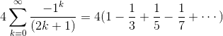
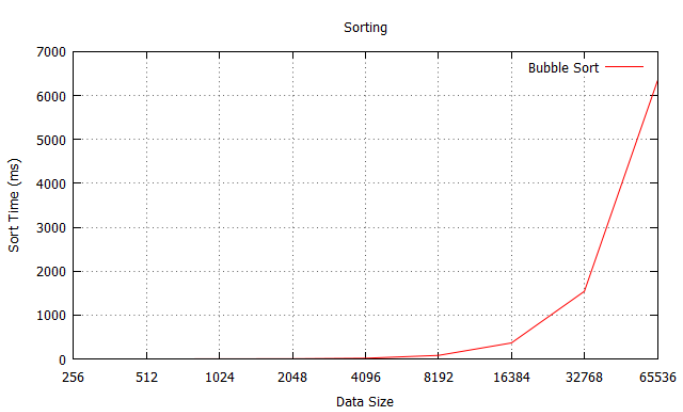
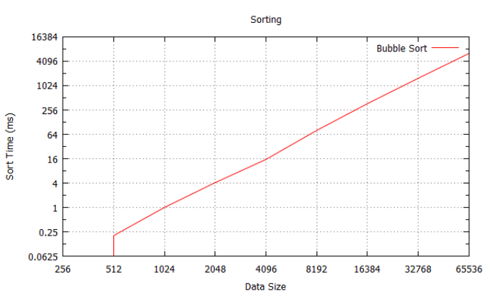
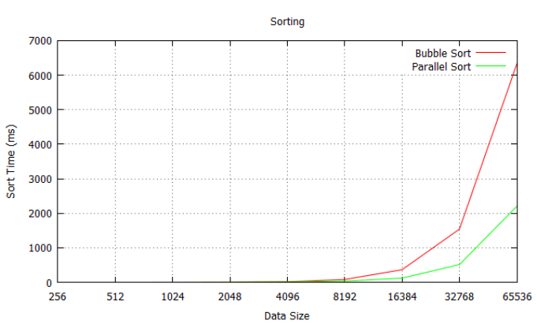
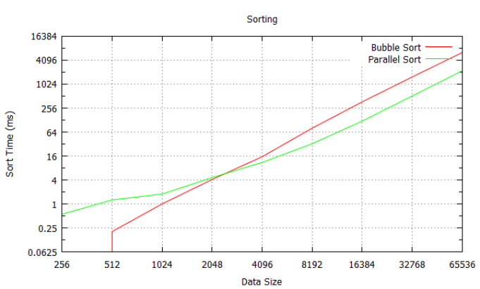
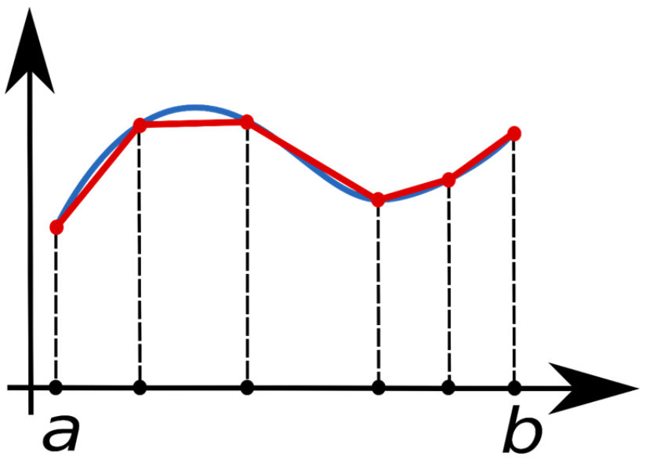
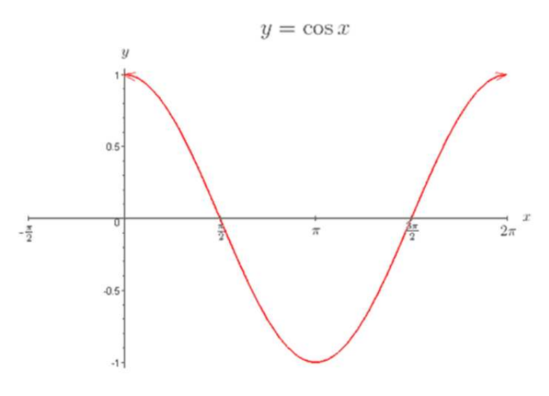
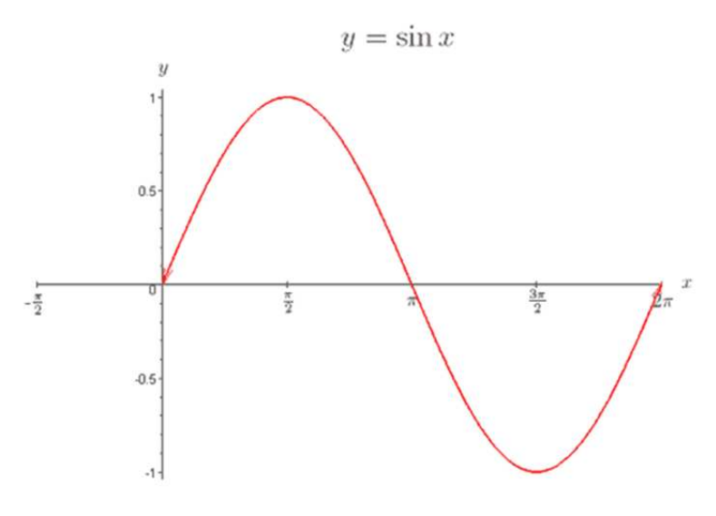

# OpenMP

We are now going to move away from using basic C++11 concurrency concepts and move into using a particular framework to support multi-processing - OpenMP. OpenMP is API that supports shared-memory parallel programming, so can enable us to work with our CPU as a multi-core device. OpenMP provides some different constructs to normal C++11 concurrency, and is itself quite a mature platform. We will look at some example applications using OpenMP that investigates these constructs before doing some analysis work.

## First OpenMP Application

Before building an OpenMP application, you need to make sure that your compiler supports it. In Visual Studio you will find an OpenMP option in the project properties (under **C++ --> Language**). You need to enable OpenMP here to ensure that our compiled application is using OpenMP.

Our first OpenMP application is going to be a very trivial Hello World example. The whole code is below:

```cpp
#include <iostream>
#include <omp.h>

using namespace std;

// Number of threads to run
constexpr int THREADS = 10;

void hello()
{
    // Get the thread number
    auto my_rank = omp_get_thread_num();
    // Get the number of threads in operation
    auto thread_count = omp_get_num_threads();
    // Display a message
    cout << "Hello from thread " << my_rank << " of " << thread_count << endl;
}

int main()
{
    // Run hello THREADS times
#pragma omp parallel num_threads(THREADS)
    hello();

    return 0;
}
```

The first thing to note is the use of the OpenMP header (`omp.h`) on line 2. You will need this for some of the OpenMP functions we use, such as getting the thread number (line 12) and the number of threads (line 14).

`hello` is our operation we are running multiple times. Line 22 shows how we do this. We are using a pre-processor to tell the compiler that OpenMP code should be generated here. We are running the operation in **`parallel`**, and using `num_threads` to tell OpenMP how many copies to run. If you run this application you should get the output shown below

```shell
Hello from thread Hello from thread Hello from thread 23 of 6Hello from thread 10 of 10 of 10

7 of 10
Hello from thread 1 of 10
Hello from thread 0 of 10
Hello from thread 8 of 10
Hello from thread 9Hello from thread  of 10
4 of 10
Hello from thread 5 of 10
```

As we are not controlling the output, there is some conflict with the threads trying to output at the same time.

## `parallel for`


OpenMP tries to extract away the idea of having threads. They still exist but they are hidden from the application developer. One of the powerful constructs OpenMP provides is `parallel for`. This allows us to create threads by executing a `for` loop. Each iteration uses a thread to compute thus providing speedup. You have to think a little when using `parallel for` but it can be useful.

### Calculating &pi; (not using Monte Carlo Simulation)

Using Monte Carlo simulation to calculate &pi; is great for testing performance and speedup, but it is not really the most efficient method of calculating &pi;. A better method to approximate &pi; is to use the following formula:



We are going to use this method in a `parallel for` to see how we can calculate &pi;.

### Parallel For Implementation of &pi; Approximation

The code below shows how we implement this in OpenMP using a `parallel for`.

```cpp
int main(int argc, char **argv)
{
    // Get number of supported threads
    auto num_threads = thread::hardware_concurrency();

    // Number of iteration values to perform
    const int n = static_cast<int>(pow(2, 30));
    // Factor value
    double factor = 0.0;
    // Calculated pi
    double pi = 0.0;

    // Parallelised for loop that does the work
#pragma omp parallel for num_threads(num_threads) reduction(+:pi) private(factor)
    for (int k = 0; k < n; ++k)
    {
        // Determine sign of factor
        if (k % 2 == 0)
            factor = 1.0;
        else
            factor = -1.0;
        // Add this iteration value to pi sum
        pi += factor / (2.0 * k + 1);
    }

    // Get the final value of pi
    pi *= 4.0;

    // Show more percision of pi
    cout.precision(numeric_limits<double>::digits10);
    cout << "pi = " << pi << endl;

    return 0;
}
```

OK, we are using quite a bit of new ideas in the pre-processor comment.  First of all, the general `parallel for` looks very similar to a standard `parallel` but with the keyword `for` added. The two new parts are at the end of the pre-processor:

- `reduction` we will be covering reduction in more detail when we look at map-reduce in MPI later in the module. What we are saying here is that addition on the `pi` variable should be controlled to add all the `for` loops together.
- `private` this indicates that each `for` loop has a private copy of the `factor` value. Each `for` loop can modify the value independently and not cause corruption to another `for` loop.

If you run this application you will get the output (accurate to 10 decimal places) below:

```shell
pi = 3.14159265265798
```

## Bubble Sort

We are now going to diverge for a bit and look at sequential sorting using a bubble sort. The reason we are doing this is because we are going to build a parallel sorting mechanism and then compare the performance. You should hopefully all be familiar with what is meant by a bubble sort by now.

We are going to build two new functions to support our application:

1. `generate_values`
2. `bubble_sort`

Our `parallel_sort` will also use value generation

### `generate_values`

Below is the function that will generate a `vector` full of values. It simply uses a random engine to do this.

```cpp
// Generates a vector of random values
vector<unsigned int> generate_values(unsigned int size)
{
    // Create random engine
    random_device r;
    default_random_engine e(r());
    // Generate random numbers
    vector<unsigned int> data;
    for (unsigned int i = 0; i < size; ++i)
        data.push_back(e());
    return data;
}
```

### `bubble_sort`

Bubble sort is a straight forward algorithm. We bubble up through the values, swapping them as we go to move a value towards the top. You should be able to implement this algorithm in C++ by now.

```psuedo
for count := values.size() to 2 do
    for i := 0 to count - 2 do
        if values[i] > values[i + 1] then
            swap values[i] and values[i + 1]
        end if
    end for
end for
```

### Main Application

Our main application will time the implementation of `bubble_sort` using vectors of different sizes:

```cpp
int main(int argc, char **argv)
{
    // Create results file
    ofstream results("bubble.csv", ofstream::out);
    // Gather results for 2^8 to 2^16 results
    for (unsigned int size = 8; size <= 16; ++size)
    {
        // Output data size
        results << pow(2, size) << ", ";
        // Gather 100 results
        for (unsigned int i = 0; i < 100; ++i)
        {
            // Generate vector of random values
            cout << "Generating " << i << " for " << pow(2, size) << " values" << endl;
            auto data = generate_values(static_cast<unsigned int>(pow(2, size)));
            // Sort the vector
            cout << "Sorting" << endl;
            auto start = system_clock::now();
            bubble_sort(data);
            auto end = system_clock::now();
            auto total = duration_cast<milliseconds>(end - start).count();
            // Output time
            results << total << ",";
        }
        results << endl;
    }
    results.close();

    return 0;
}
```

If you run this application you should be able to produce a graph as below:



However, you should change the y-axis scale to use a `log2` scale to give a straight line.



**Make sure your charts are presented correctly**.  We use the `log2` scale here as our data scales by powers of two.  However, a line chart is incorrect here as the data is not continuous.  A bar or column chart would be better.

Parallel Sort
-------------

All we need to do for a `parallel for` is change one method -- the sort. Below is a `parallel_sort` taken from *An Introduction to Parallel Programming*. An in-depth description of its development is available in the book (in the OpenMP section).

```cpp
void parallel_sort(vector<unsigned int>& values)
{
    // Get the number of threads
    auto num_threads = thread::hardware_concurrency();
    // Get the number of elements in the vector
    auto n = values.size();
    // Declare the variables used in the loop
    int i, tmp, phase;
    // Declare parallel section
#pragma omp parallel num_threads(num_threads) default(none) shared(values, n) private(i, tmp, phase)
    for (phase = 0; phase < n; ++phase)
    {
        // Determine which phase of the sort we are in
        if (phase % 2 == 0)
        {
            // Parallel for loop.  Each thread jumps forward 2 so no conflict
#pragma omp for
            for (i = 1; i < n; i += 2)
            {
                // Check if we should swap values
                if (values[i - 1] > values[i])
                {
                    // Swap values
                    tmp = values[i - 1];
                    values[i - 1] = values[i];
                    values[i] = tmp;
                }
            }
        }
        else
        {
            // Parallel for loop.  Each thread jumps forward 2 so no conflict
#pragma omp for
            for (i = 1; i < n; i += 2)
            {
                // Check is we should swap values
                if (values[i] > values[i + 1])
                {
                    // Swap values
                    tmp = values[i + 1];
                    values[i + 1] = values[i];
                    values[i] = tmp;
                }
            }
        }
    }
}
```

Of more interest is the results.  Normal and logarithmic scaling is provided for comparison.





Notice that for small vector sizes throwing parallelism at the problem has not given us a performance boost - in fact we are slower. Granted we are using a slightly different algorithm, but hopefully you can see that the problem set is too small to get any speed up - in fact the setup and control of the OpenMP program is having an effect. Once our sort space is large enough we gain performance - 3+ times as much (the CPU is dual core with 4 hardware threads so this seems reasonable).

## The Trapezoidal Rule

Our next use of OpenMP will look at something called the trapezoidal rule. This technique can be used to approximate the area under a curve.



We select a number of points on the curve and measure their value. We then use this to generate a number of trapezoids. We can then calculate the area of the trapezoids and get an approximate value for the area under the curve. The more points we use on the curve, the better the result.

For our purposes we do not need to worry about why we want to do this - the point is we can parallelise the problem by calculating more trapezoids.

### Trapezoidal Function

The function to work out a section of the area under a curve using the trapezoidal rule is below:

```cpp
void trap(function<double(double)> f, double start, double end, size_t iterations, shared_ptr<double> p)
{
    // Get thread number
    auto my_rank = omp_get_thread_num();
    // Get number of threads
    auto thread_count = omp_get_num_threads();
    // Calculation iteration slice size
    auto slice_size = (end - start) / iterations;
    // Calculate number of iterations per thread
    auto iterations_thread = iterations / thread_count;
    // Calculate this thread's start point
    auto local_start = start + ((my_rank * iterations_thread) * slice_size);
    // Calculate this thread's end point
    auto local_end = local_start + iterations_thread * slice_size;
    // Calculate initial result
    auto my_result = (f(local_start) + f(local_end)) / 2.0;

    // Declare x before the loop - stops it being allocated and destroyed each iteration
    double x;
    // Sum each iteration
    for (size_t i = 0; i <= iterations_thread - 1; ++i)
    {
        // Calculate next slice to calculate
        x = local_start + i * slice_size;
        // Add to current result
        my_result += f(x);
    }
    // Multiply the result by the slice size
    my_result *= slice_size;

    // Critical section - add to the shared data
#pragma omp critical
    *p += my_result;
}
```

The incoming parameters are as follows:

- `f` the function we are using to generate the curve.
- `start` the starting value we will place in the function.
- `end` the end value we will place in the function.
- `iterations` the number of iterations (or trapezoids) we will generate.
- `p` a shared piece of data to store the result.

You should be able to follow the algorithm using the comments. The new part we have introduced from OpenMP is a `critical` section. A `critical` section is just a piece of code that only one thread can access at a time - it is controlled by a mutex. We use the `critical` section to control the adding of the local result to the global result.

### Testing the Trapezoidal Algorithm

There is a simple test we can perform to check our algorithm using the standard trigonometric functions. For example, the cosine function is:



The area under the curve between 0 and &pi; radians should equal 0 - it is equal parts above and below the line over this period. The sine function is:



The area under the curve here is 2. Let us first test the cosine
function..

```cpp
int main(int argc, char **argv)
{
    // Declare shared result
    auto result = make_shared<double>(0.0);
    // Define start and end values
    auto start = 0.0;
    auto end = 3.14159265359; // pi
    // Defined number of trapezoids to generation
    auto trapezoids = static_cast<size_t>(pow(2, 24));
    // Get number of threads
    auto thread_count = thread::hardware_concurrency();

    // Create function to calculate integral of.  Use cos
    auto f = [](double x){ return cos(x); };

    // Run trap in parallel
#pragma omp parallel num_threads(thread_count)
    trap(f, start, end, trapezoids, result);

    // Output result
    cout << "Using " << trapezoids << " trapezoids. ";
    cout << "Estimated integral of function " << start << " to " << end << " = " << *result << endl;

    return 0;
}
```

We set our function as a &lambda; expression and pass this into our trap algorithm. If you run this you will get:

```shell
Using 16777216 trapezoids. Estimated integral of function 0 to 3.14159 = 1.87253e-07
```

So our result is 0.000000187253 or pretty close to 0 for an estimate with rounding errors. If you change the application to use the sine function we get:

```shell
Using 16777216 trapezoids. Estimated integral of function 0 to 3.14159 = 2
```

Which is the answer we expect.

## Scheduling

Our next concept we will introduce is the idea of scheduling our work in OpenMP. Scheduling involves us telling OpenMP how to divide up the work in a `parallel for`. At the moment, each thread is given a chunk of work in order. For example, if we have 1024 iterations and we have 4 threads, our work is divided as follows:

- **Thread 1** iterations 0 to 255.
- **Thread 2** iterations 256 to 511.
- **Thread 3** iterations 512 to 767.
- **Thread 4** iterations 768 to 1023.

For many problems that divide simply, this works ideally. However, many problems do not divide like this. Scheduling in OpenMP allows us to divide up our work in different manners. Chapter 5 of *Introduction to Parallel Programming* gives more details.

The scheduling method we will use is called `static`. This allows us to allocate work to threads in a round robin manner. For example, a schedule of 1 allocates the work to thread in blocks of 1:

- **Thread 1** 0, 4, 8, 12, ...
- **Thread 2** 1, 5, 9, 13, ...
- **Thread 3** 2, 6, 10, 14, ...
- **Thread 4** 3, 7, 11, 15, ...

Using a schedule of 2 allocates work to threads in blocks of 2:

- **Thread 1** 0, 1, 8, 9, ...
- **Thread 2** 2, 3, 10, 11, ...
- **Thread 3** 4, 5, 12, 13, ...
- **Thread 4** 6, 7, 14, 15, ...

And so on.

### Test Function

Below is a function that can test the effect of scheduling for us. It runs based on the value of `i` passed in.

```cpp
// Let's create a function that relies on i to determine the amount of work
double f(unsigned int i)
{
    // Calculate start and end values
    auto start = i * (i + 1) / 2;
    auto end = start + i;
    // Declare return value
    auto result = 0.0;

    // Loop for number of iterations, calculating sin
    for (auto j = start; j <= end; ++j)
        result += sin(j);

    // Return result
    return result;
}
```

### Main Application

Below is our test application. We use the schedule function in the pre-processor argument to control the division of work. Your task here is to manipulate the schedule value and see the effect.

```cpp
int main(int argc, char **argv)
{
    // Get number of hardware threads
    auto thread_count = thread::hardware_concurrency();
    // Define number of iterations to calculate
    auto n = static_cast<size_t>(pow(2, 14));
    // Declare sum value
    auto sum = 0.0;

    // Get start time
    auto start = system_clock::now();
#pragma omp parallel for num_threads(thread_count) reduction(+:sum) schedule(static, 1)
    for (auto i = 0; i <= n; ++i)
        sum += f(i);
    // Get end time
    auto end = system_clock::now();
    // Calculate and output total time
    auto total = duration_cast<milliseconds>(end - start).count();
    cout << "Total time: " << total << "ms" << endl;

    return 0;
}
```

Running this application will output a timing value - test the scheduling value and chart the difference in performance.

## Exercises

1. Try using the schedule technique to split up the work for the Mandelbort fractal - this will allow you even more control over how the work is divided and should enable some speedup. You need to understand where the likely bottlenecks are in the algorithm in relation to the image produced to work out how best to split it up using OpenMP.
2. You now have enough information to build a queue to act as a message passing interface. Build one -- either using standard C++11 threading or OpenMP or both - and show it works using a basic producer-consumer model.
3. Experiment with the Concurrency Visualizer. You have enough applications now to really explore what is happening. Try and create hundreds of threads to see how the pre-emption can change.

## Reading

You should be reading Chapter 5 of Introduction to Parallel Programming for more information on OpenMP.
