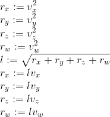

# CPU Instructions

After last weeks practical in high-level OpenMP we are going to dive down to instruction-level parallelism. We will look at how modern processors support 128-bit and 256-bit registers to perform a single operation on multiple values.

A word of warning! The techniques we are going to use are supported on Intel and AMD based hardware. Visual Studio turns on optimisations by default - you will need to disable them to see a difference in performance. You can find the setting in the project properties in the C++ section, under **Optimization**. You will want to disable optimization. Otherwise you might not see a performance difference.

If you are using the command-line, `clang` of `gcc` you probably aren't using optimisation.  This is done using the `-O3` (`clang` and `gcc`) or `/Ox` (Microsoft) compiler flag.  If you are using those flags, don't for this lab.

In Cmake, if you are just doing a standard build you don't have to worry.

## Memory Alignment

To use SIMD instructions we need the correct header:

```cpp
#include <immintrin.h>
```

SIMD (Single-Instruction, Multiple-Data) instructions perform a single-instruction (e.g., add) on multiple values at once.  They do this by using larger data-types, such as 128-bit types.  These are just four 32-bit values.  The type we will use first is `__m128`.  We can use the C++ `union` to have a value that is represented either as an `__m128` or a `float[4]`.

```cpp
// Union can flip between the types within.
union v4
{
    __m128 v;    // SSE 4 x float vector
    float a[4];  // scalar array of 4 floats
};
```

To exploit SIMD instructions, data needs to be *streamed* to the processor.  This is achieved via aligning memory correctly yo allow data to be read efficiently by the CPU.  Our first application will illustrate how we can align memory correctly in C++:

```cpp
int main(int argc, char **argv)
{
    // Declare a single 128-bit value aligned to 16 bytes (size of 128-bits)
    alignas(16) v4 x;
    // We can treat x as a collection of four floats
    // Or other combinations of values for 128-bits
    x.a[0] = 10.0f;
    x.a[1] = 20.0f;
    x.a[2] = 30.0f;
    x.a[3] = 40.0f;
    // We can print out individual values
    cout << "Original values" << endl;
    for (size_t i = 0; i < 4; ++i)
        cout << x.a[i] << endl;

    // Declared a second 128-bit value alignted to 16 bytes (size of 128-bits)
    alignas(16) v4 y;
    y.a[0] = 10.0f;
    y.a[1] = 20.0f;
    y.a[2] = 30.0f;
    y.a[3] = 40.0f;
    // Add y to x
    x.v = _mm_add_ps(x.v, y.v);
    // Print out individual values
    cout << "New values" << endl;
    for (size_t i = 0; i < 4; ++i)
        cout << x.a[i] << endl;

    // Create array of 100 floats, aligned to 4 bytes.
    float *data = (float*)aligned_alloc(4, 100 * sizeof(float));
    // Access just like an array
    cout << data[0] << endl;

    // Create an array of 100 128-bit values aligned to 16 bytes
    v4 *big_data = (v4*)aligned_alloc(16, 100 * sizeof(v4));

    // Access just like an array of __m128
    cout << big_data[0].a[0] << endl;

    // Free the data - ALWAYS REMEMBER TO FREE YOUR MEMORY
    // We are dealing at a C level here
    free(data);
    free(big_data);

    return 0;
}
```

`alignas(N)` tells the C++ compiler how to align memory.  Here we say as a 16-byte alignment, meaning the CPU can read the data into a 128-bit (16-byte) register efficiently.

`aligned_alloc` creates large blocks of aligned memory (`alloc` is short for allocation). The first parameter is the alignment size and the second parameter is the total number of bytes to allocate.  Any allocated memory must be freed using the `free` function to release the memory for reuse.

Running this application will not do much - it will print out a couple of values. The point is to introduce to the methods of allocating memory aligned data.

## SIMD Operations

Allocating memory is just one step of our work with the processor. The next stage is to use SIMD based operations. There are quite [a few](https://software.intel.com/sites/landingpage/IntrinsicsGuide/).  We will only use a couple of these here for illustration purposes. The rest is up to you.

Our first test application will time adding 1 million floats using standard techniques, 128-bit registers, and 256-bit registers.  The application is below.  First, we test to make sure the add works properly.  This is just to make sure your processor supports these instructions.  In the exercises 512-bit registers are introduced and you should perform the equivalent tests.

```cpp
#include <iostream>
#include <immintrin.h>
#include <cassert>
#include <chrono>

using namespace std;
using namespace std::chrono;

union v4
{
    __m128 v;
    float a[4];
};

union v8
{
    __m256 v;
    float a[8];
};

int main(int argc, char **argv)
{
    // Test all types to ensure add is working
    {
        alignas(16) v4 x;
        alignas(16) v4 y;
        for (size_t i = 0; i < 4; ++i)
        {
            x.a[i] = static_cast<float>(i);
            y.a[i] = static_cast<float>(i);
        }
        x.v = _mm_add_ps(x.v, y.v);
        for (size_t i = 0; i < 4; ++i)
            assert(x.a[i] == static_cast<float>(2 * i));
    }
    {
        alignas(32) v8 x;
        alignas(32) v8 y;
        for (size_t i = 0; i < 8; ++i)
        {
            x.a[i] = static_cast<float>(i);
            y.a[i] = static_cast<float>(i);
        }
        x.v = _mm256_add_ps(x.v, y.v);
        for (size_t i = 0; i < 8; ++i)
            assert(x.a[i] == static_cast<float>(2 * i));
    }

    // Add 1 million float values
    // First using floats
    {
        float *d1 = (float*)aligned_alloc(4, sizeof(float) * 1000000);
        float *d2 = (float*)aligned_alloc(4, sizeof(float) * 1000000);
        auto start = system_clock::now();
        for (size_t count = 0; count < 100; ++count)
        {
            for (size_t i = 0; i < 1000000; ++i)
                d1[i] = d1[i] + d2[i];
        }
        auto total = (system_clock::now() - start).count() / 100;
        cout << "float time: " << total << "ns" << endl;
        free(d1);
        free(d2);
    }
    // Now using _m128
    {
        v4 *d1 = (v4*)aligned_alloc(16, sizeof(v4) * 500000);
        v4 *d2 = (v4*)aligned_alloc(16, sizeof(v4) * 500000);
        auto start = system_clock::now();
        for (size_t count = 0; count < 100; ++count)
        {
            for (size_t i = 0; i < 500000; ++i)
                d1[i].v = _mm_add_ps(d1[i].v, d2[i].v);
        }
        auto total = (system_clock::now() - start).count() / 100;
        cout << "m128 time: " << total << "ns" << endl;
        free(d1);
        free(d2);
    }
    // Now using _m256
    {
        v8 *d1 = (v8*)aligned_alloc(32, sizeof(v8) * 250000);
        v8 *d2 = (v8*)aligned_alloc(32, sizeof(v8) * 250000);
        auto start = system_clock::now();
        for (size_t count = 0; count < 100; ++count)
        {
            for (size_t i = 0; i < 250000; ++i)
                d1[i].v = _mm256_add_ps(d1[i].v, d2[i].v);
        }
        auto total = (system_clock::now() - start).count() / 100;
        cout << "m256 time: " << total << "ns" << endl;
        free(d1);
        free(d2);
    }

    return 0;
}
```

**Trouble compiling this application?** We are using SSE4 and AVX in this application.  In `clang` and `gcc` you will need the `-msse4 -mavx` compilation flags.

`_mm_add_ps` adds two 128-bit values (as four 32-bit values) and `_mm256_add_ps` does likewise for 256-bit values. There are instructions for adding, multiplying, etc.  For timing, you will need to ensure that optimisation is off.  An example result is:

```shell
float time: 2846471ns
m128 time: 1957456ns
m256 time: 1394825ns
```

We are getting a more than 2 times speedup using `_m256`. This is the power of SIMD operations - we can use them to speed up all sorts of numerical applications.

The CPU these timings came from was an Intel i5-3437U running at 1.9GHz - a laptop CPU.  1.9GHz is 1.9 billion ticks per second, 1.9 ticks per ns, or a tick every 0.53ns.  Light has only travelled about 16cm in that time.  1 million adds were performed in 1,394,825ns, or an add every 1.3ns.  Light travelled about 39cm in that time.  We are performing a floating point addition in less than three ticks here, which is fast.  32-bit integer adds will likely be faster.  And we are close to the physical limits we can transfer information.

## Normalizing a Vector

We are now going to use a SIMD approach to normalize 4-dimensional vectors.  The same technique could be used for 3-dimensional vectors easily enough.  We are going to use SIMD instructions to parallelise the process. The algorithm is:



First of all we are going to generate a collection of random values.

```cpp
// Randomly generate vector values
void generate_data(v4 *data, size_t n)
{
    // Create random engine
    random_device r;
    default_random_engine e(r());
    // Fill data
    for (size_t i = 0; i < n; ++i)
        for (size_t j = 0; j < 4; ++j)
            data[i].a[j] = e();
}
```

Our normalization process is:.

```cpp
// Normalises the vector
void normalise_vectors(v4 *data, v4 *result, size_t n)
{
    // Normalise the vectors
    for (size_t i = 0; i < n; ++i)
    {
        // Square each component - simply multiply the vectors by themselves
        result[i].v = _mm_mul_ps(data[i].v, data[i].v);
        // Calculate sum of the components.
        // See notes to explain hadd.
        result[i].v = _mm_hadd_ps(result[i].v, result[i].v);
        result[i].v = _mm_hadd_ps(result[i].v, result[i].v);
        // Calculate reciprocal square root of the values
        // That is 1.0f / sqrt(value) - or the length of the vector
        result[i].v = _mm_rsqrt_ps(result[i].v);
        // Multiply result by the original data
        // As we have the reciprocal it is the same as dividing each component
        // by the length
        result[i].v = _mm_mul_ps(data[i].v, result[i].v);
    }
    // All vectors now normalised
}
```

There are a few new ideas here:

1. `_mm_mul_ps` multiplies the components of two vectors together.  Here, we are saying `v = v * v` which is the same as `a[0] = a[0] * a[0]; a[1] = a[1] * a[1];` etc.
2. `_mm_hadd_ps` performs an adjacent component add.  Consider the two parameters as `a` and `b`.  The return value, `c`, becomes `{a[3] + a[2], a[1] + a[0], b[3] + b[2], b[1] + b[1]}`.  We are reusing `v` here.  The first call to `_mm_hadd_ps` means `v = {a[3] + a[2], a[1] + a[0], a[3] + a[2], a[1] + a[0]}`.  The second call to `_mm_hadd_ps` means each component of `v` equals `a[3] + a[2] + a[1] + a[0]`.
3. `_mm_rsqrt_ps` gets the reciprocal square root of each components of `v`.  That is, `a[0] = 1 / sqrt(a[0]); a[1] = 1 / sqrt(a[1]);` etc.  As each component contains the summed squares of the original components, each component now contains `1 / l` where `l` is the length of the vector.
4. The final `_mm_mul_ps` multiplies `1 / l` by the original value for each component.  This is the same as dividing each component by `l`, which is the aim of the algorithm.

We can check the results:

```cpp
// Check the first 100 results
void check_results(v4 *data, v4 *result)
{
    // Check first 100 values
    for (size_t i = 0; i < 100; ++i)
    {
        // Calculate the length of the vector
        float l = 0.0f;
        // Square each component and add to l
        for (size_t j = 0; j < 4; ++j)
            l += powf(data[i].a[j], 2.0f);
        // Get sqrt of the length
        l = sqrtf(l);
        // Now check that the individual results
        for (size_t j = 0; j < 4; ++j)
            cout << data[i].a[j] / l << " : " << result[i].a[j] << endl;
    }
}
```

**Trouble compiling this application?** We are using SSE3 here, and you will need to enable it in the compiler.  For `clang` and `gcc` use the `-msse3` compilation flag.

Running this application will produce the following output:

```shell
...
0.22707 : 0.227083
0.682945 : 0.682982
0.250351 : 0.250365
0.386064 : 0.386066
0.330882 : 0.330884
0.243892 : 0.243894
0.825826 : 0.825832
0.103029 : 0.103032
0.537699 : 0.537715
0.611587 : 0.611605
0.571162 : 0.571179
0.885999 : 0.885939
0.163822 : 0.163811
0.431338 : 0.431309
0.045999 : 0.0459959
```

You will notice that the values do not quite match. This is because we used a reciprocal method to normalize the vectors. This involved a fast multiplication over a slow division - but does mean we the value is less accurate. However, as you can see from the data our results are close enough.

## Exercises

We have really only scratched the surface of what is possible with SIMD instructions. The following exercises should help you fill out your knowledge.

1. Try some of the other SIMD instructions and see how they behave.
2. Calculate some timing information for the normalization application
3. Try and parallelize the normalization application using multithreading or OpenMP. Compare the time taken against SIMD.
4. Monte Carlo &pi; works on the principal of the length of a random vector. Can you build a version of Monte Carlo &pi; using SIMD instructions? Can you also parallelize it further using OpenMP or multithreading?
5. A `_m512` type is supported by some processors.  Try it on your machine and add new timing information for the addition application.