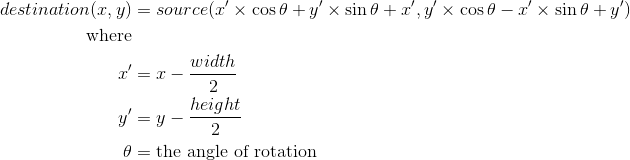

# GPU Programming Examples

In this unit we are going to look at some GPU samples. We will look at OpenCL and CUDA examples where possible. The general approaches are the same. We will start by looking at some of the problems we have already looked at, before moving onto some other ideas. Most of these examples will be only briefly discussed, as you should be able to implement the necessary applications by now. You should also be taking timings to compare performance with sequential, multithreaded, MPI, and other solutions.

## Monte Carlo &pi;

Monte Carlo &pi; was our first problem examined, so you should have a good understanding of the principle by now. We will look at one OpenCL and a number of CUDA solutions. OpenCL can handle most of the CUDA approaches as well, so you can implement these too if you wish.

### OpenCL Monte Carlo &pi;

For this application you will have to generate some random values and pass them to the GPU. OpenCL comes with a type that can be used to represent a 2D position in space - `float2`. This is the type used in the kernel. For our main application, the type is `cl_float2`. The general approach we are taking is as follows:

1. Generate random points on CPU - one point for each thread.
2. Allocate memory for points and a result value (0 or 1) for each thread.
3. Copy points to GPU.
4. Run kernel.
5. Get results back from GPU.
6. Sum results.
7. Calculate &pi;

You are only provided with the kernel.  It is up to you to implement the necessary main application.

```opencl
__kernel void monte_carlo_pi(__global float2 *points, __local char *local_results, __global int *global_results)
{
    // Get our id
    unsigned int global_id = get_global_id(0);
    unsigned int local_id = get_local_id(0);
    unsigned int local_dim = get_local_size(0);
    unsigned int group_id = get_group_id(0);
    
    // Get the point to work on
    float2 point = points[global_id];
    // Calculate the length - built-in OpenCL function
    float l = length(point);
    // Result is either 1 or 0
    if (l <= 1.0f)
        local_results[local_id] = 1;
    else
        local_results[local_id] = 0;

    // Wait for the entire work group to get here.
    barrier(CLK_LOCAL_MEM_FENCE);

    // If work item 0 in work group sum local values
    if (local_id == 0)
    {
        int sum = 0;
        for (int i = 0; i < local_dim; ++i)
        {
            if (local_results[i] == 1)
                ++sum;
        }
        global_results[group_id] = sum;
    }
}
```

### CUDA Monte Carlo &pi;

For CUDA, we will look at a few different approaches which allow us to examine potential performance gains. We will implement the same solution as OpenCL first. Then we will look at a solution using a `for` loop within a kernel, generating random values using CUDA, and finally summing on the GPU rather than the CPU.

#### Standard Approach

Our standard approach follows the same method as we undertook for OpenCL. Therefore, the kernel is just provided.

```cuda
__global__ void monte_carlo_pi(const float2 *points, char *results)
{
    // Calculate index
    unsigned int idx = (blockIdx.x * blockDim.x) + threadIdx.x;
    
    // Get the point to work on
    float2 point = points[idx];
    // Calculate the length - not built-in
    float l = sqrtf((point.x * point.x) + (point.y * point.y));
    // Check if in circle
    if (l <= 1.0)
        results[idx] = 1;
    else
        results[idx] = 0;
}
```

Notice that CUDA does not provide a `length` function like OpenCL, so we have to calculate the length manually.

#### Using a `for` Loop in the Kernel

Our next implementation is going to move towards our CPU implementation of Monte Carlo &pi;. We do this by undertaking a number of iterations on each thread rather than a thread calculating a single point. For example, if we consider a solution where we have 2<sup>24</sup> points to check, we need to run 2<sup>24</sup> threads and copy back 2<sup>24</sup> bytes (16 MBytes) of data to main memory to sum the result.

If we allow each thread to calculate a number of iterations, we increase the amount of work a single thread does, while reducing the number of threads run and decreasing the memory usage. For example, if we have 2<sup>24</sup> points to calculate and let each thread run 2<sup>16</sup> iterations (so each thread calculates 2<sup>16</sup> points), then we only run 2<sup>8</sup> threads, and only copy back 2<sup>8</sup> *4 (we need an `int` now) bytes (1024 bytes or 0.001 MBytes).

```cuda
__global__ void monte_carlo_pi(unsigned int iterations, float2 *points, int *results)
{
    // Calculate index
    unsigned int idx = (blockIdx.x * blockDim.x) + threadIdx.x;
    // Calculate starting point
    unsigned int start = idx * iterations;
    // Calculate end point
    unsigned int end = start + iterations;
    // Set starting result to 0
    results[idx] = 0;
    // Loop for iterations
    for (unsigned int i = start; i < end; ++i)
    {
        // Get the point to work on
        float2 point = points[i];
        // Calculate the length
        float l = sqrtf((point.x * point.x) + (point.y * point.y));
        // Check length and add to result accordingly
        if (l <= 1.0f)
            ++results[idx];
    }
}
```

The same approach is required as before, except you have to consider the amount of data required to copy back and and the number of threads against the iterations per thread. You should experiment with different configurations to explore the different performance characteristics.  Also try different thread to block ratios to further analyse performance. You will be surprised how some tweaks can alter performance.

#### Using CUDA to Generate Random Points

We can also get CUDA to generate our random values for us directly on the GPU. To do this we will need to use [`cuRand`](http://docs.nvidia.com/cuda/curand/).  You will need to read a little bit about how to use cuRand, but example code for generating random values (in your main application - not the kernel).  Note that this approach generates random values across 2-dimensions (since we have 2-dimensional values). Other approaches could also be used. Read more on `cuRand` to find out.

```cuda
// Create random values on the GPU
// Create generator
curandGenerator_t rnd;
curandCreateGenerator(&rnd, CURAND_RNG_QUASI_SOBOL32);
curandSetQuasiRandomGeneratorDimensions(rnd, 2);
curandSetGeneratorOrdering(rnd, CURAND_ORDERING_QUASI_DEFAULT);

// Generate random numbers - point_buffer is an allocated device buffer
curandGenerateUniform(rnd, (float*)point_buffer, 2 * NUM_POINTS);

// Destroy generator
curandDestroyGenerator(rnd);
```

You can use the same kernel as previously. All you are changing is how you are generating random values.

#### Summing on the Kernel

Our final approach to Monte Carlo &pi; involves us performing the final stage of the computation (the calculation of &pi;) on the GPU. To do this, we will use a new function within our kernel - `__syncthreads`.  This function allows us to stop all threads within a block at a particular point in our code. *Note that only threads in the same block will synchronise*.  This means that if you have more than one block, not all threads will synchronise. For our implementation to work then you can only have one block.

```cuda
__global__ void monte_carlo_pi(unsigned int iterations, float2 *points, char *results, double *pi)
{
    // Calculate index
    unsigned int idx = (blockIdx.x * blockDim.x) + threadIdx.x;
    // Calculate starting point
    unsigned int start = idx * iterations;
    // Calculate end point
    unsigned int end = start + iterations;
    // Loop for iterations
    for (unsigned int i = start; i < end; ++i)
    {
        // Get the point to work on
        float2 point = points[i];
        // Calculate the length
        float l = sqrtf((point.x * point.x) + (point.y * point.y));
        // Check length and add to result accordingly
        if (l <= 1.0f)
            ++results[idx];
    }
    // Sync threads in block
    __syncthreads();
    // If idx = 0 perform the sum
    if (idx == 0)
    {
        // Number of threads in block
        unsigned int elements = blockDim.x;
        // Sum result
        unsigned int sum = 0;
        for (unsigned int i = 0; i < elements; ++i)
            sum += results[i];
        
        // Calculate pi
        pi[0] = (4.0 * (double)sum) / (double)elements;
    }
}
```

Note that you only have to copy back one value - the `float` containing &pi;.  Our host actually needs no buffers of data allocated if you are generating random values using CUDA as well.  All data is just allocated on the GPU.

### Exercises

1. Can you implement OpenCL versions of the different CUDA approaches?  The random number generation approach you will likely need a library.
2. CUDA also allows you to generate random numbers within a kernel.  Find out how to do this and reimplement the summing solution using this approach. Gather timings (taking into account random generation time for the original summing solution) and draw some conclusions.
3. In all cases we have calculated the length using standard Pythagoras. This can be slightly optimised very trivially. Try and do this and see the difference in results.

## Mandelbrot Fractal

The Mandelbrot fractal we introduced when working with futures.  We used a particular technique then called the *Escape Time Algorithm*.  We can also implement this on the GPU. Let us look at examples in OpenCL and CUDA.

### OpenCL Mandelbrot

Our kernel this time involves loops and branching statements - which might be an issue for performance.

```opencl
// This kernel is adapted from Ben Hiller's code on Github
// https://github.com/benhiller/opencl-mandelbrot

// Convert the raw x coordinates [0, 1] into a scaled coordinate
// [0, 1] -> [-2, 1.25]
float mapX(float x)
{
    return x * 3.25f - 2.0f;
}

// Same purpose as mapX
// [0, 1] -> [-1.25, 1.25]
float mapY(float y)
{
    return y * 2.5f - 1.25f;
}

__kernel void mandelbrot(__global char *out)
{
    int x_dim = get_global_id(0);
    int y_dim = get_global_id(1);
    size_t width = get_global_size(0);
    size_t height = get_global_size(1);
    int idx = width * y_dim + x_dim;
    
    float x_origin = mapX((float)x_dim / (float)width);
    float y_origin = mapY((float)y_dim / (float)height);
    
    // Escape time algorithm.  Follows the pseudocode from Wikipedia _very_ closely
    float x = 0.0f;
    float y = 0.0f;
    
    int iteration = 0;
    
    // This can be changed to be more or less precise
    int max_iteration = 256;
    
    // While loop - is this the best option???
    while (x * x + y * y <= 4 && iteration < max_iteration)
    {
        float xtemp = x * x - y * y + x_origin;
        y = 2 * x * y + y_origin;
        x = xtemp;
        ++iteration;
    }
    
    if (iteration == max_iteration)
        // This coordinate did not escape, so is in the Madelbrot set
        out[idx] = 0;
    else
        // This coordinate did escape, so colour based on how quickly it escaped
        out[idx] = iteration;
}
```

Our main application just needs to declare our data that we read back into and use for our image.

```cpp
#define __CL_ENABLE_EXCEPTIONS

#include <iostream>
#include <fstream>
#include <string>
#include <vector>
#include <array>
#include <random>
#include <CL/cl.hpp>

using namespace std;
using namespace cl;

constexpr cl_uint DIMENSION = 8192;
constexpr cl_uint ELEMENTS = DIMENSION * DIMENSION;

int main(int argc, char **argv)
{
	// Host data
	vector<cl_char> results(ELEMENTS);

	try
	{
		// Get the platforms
		vector<Platform> platforms;
		Platform::get(&platforms);

		// Assume only one platform.  Get GPU devices.
		vector<Device> devices;
		platforms[0].getDevices(CL_DEVICE_TYPE_GPU, &devices);

		// Just to test, print out device 0 name
		cout << devices[0].getInfo<CL_DEVICE_NAME>() << endl;

		// Create a context with these devices
		Context context(devices);

		// Create a command queue for device 0
		CommandQueue queue(context, devices[0]);

		// Create device buffer
		Buffer bufResults(context, CL_MEM_WRITE_ONLY, ELEMENTS * sizeof(char));

		// Read in kernel source
		ifstream file("mandelbrot.cl");
		string code(istreambuf_iterator<char>(file), (istreambuf_iterator<char>()));

		// Create program
		Program::Sources source(1, make_pair(code.c_str(), code.length() + 1));
		Program program(context, source);

		// Build program for devices
		program.build(devices);

		// Create the kernel
		Kernel kernel(program, "mandelbrot");

		// Set the kernel arguments
		kernel.setArg(0, bufResults);

		// Execute the kernel
		NDRange global(DIMENSION, DIMENSION);
		NDRange local(1, 1);
		queue.enqueueNDRangeKernel(kernel, NullRange, global, local);

		// Read the output buffer back to the host
		queue.enqueueReadBuffer(bufResults, CL_TRUE, 0, ELEMENTS * sizeof(char), &results[0]);

		// Dump image data as raw RGB.  You will need to convert it.
		vector<char> rgb(ELEMENTS * 3);
		for (std::size_t i = 0; i < ELEMENTS; ++i)
		{
			for (std::size_t j = 0; j < 3; ++j)
			{
				rgb[i * 3 + j] = results[i];
			}
		}
		ofstream image("mandelbrot.rgb", ios::binary);
		image.write(&rgb[0], rgb.size());
		image.close();

		cout << "Finished" << endl;

		getchar();
	}
	catch (Error error)
	{
		cout << error.what() << "(" << error.err() << ")" << endl;
	}
	return 0;
}
```

### Exercise

You should be able to convert the OpenCL version of Mandelbrot to a CUDA version fairly trivially. Do this now to ensure you understand the basic concepts behind making a CUDA application.

## Trapezoidal Rule

Our next example returns to the trapezoidal rule application we looked at with OpenMP. This time, we will use CUDA. Remember that the trapezoidal rule works by calling a particular function that we sample based on a value based on the thread ID. To do this, we need to introduce another idea for CUDA - device callable functions.

Up until now with CUDA we have defined functions using `__global__`.  This defines code that runs on the GPU and is callable from our main application. For code that runs on the GPU and is callable from other GPU code we use `__device__`.

```cuda
__device__ double func(double x)
{
    return sin(x);
}

__global__ void trap(double start, double end, unsigned int iterations, double *results)
{
    // Get global thread ID
    unsigned int idx = (blockIdx.x * blockDim.x) + threadIdx.x;
    // Get number of threads
    unsigned int thread_count = gridDim.x * blockDim.x;
    // Calculate iteration slice size
    double slice_size = (end - start) / iterations;
    // Calculate number of iterations per thread
    unsigned int iterations_thread = iterations / thread_count;
    // Calculate this thread's start point
    double local_start = start + ((idx * iterations_thread) * slice_size);
    // Calculate this thread's end point
    double local_end = local_start + iterations_thread * slice_size;
    // Calculate initial result
    results[idx] = (func(local_start) + func(local_end)) / 2.0;
    // Declare x before the loop - stops it being allocated and destroyed each iteration
    double x;
    // Sum each iteration
    for (unsigned int i = 0; i <= iterations_thread - 1; ++i)
    {
        // Calculate next slice to calculate
        x = local_start + i * slice_size;
        // Add to current result
        results[idx] += func(x);
    }
    // Multiply the result by the slice size
    results[idx] *= slice_size;
}
```

You will have to write the rest of the CUDA code yourself, but you should be able to do this easily enough.

### Exercise

This time write the equivalent application in OpenCL. This again should be fairly trivial.

## Image Rotation

Let us now look at a new example - image rotation. Image rotation involves us working on a large buffer of data that represents our image, creating another large buffer of the same size, and setting the values in this buffer based on the following calculation:



An example of the output from the application is:


In OpenCL our kernel code is:

```opencl
__kernel void image_rotate(__global int *dest_data, __global int *src_data, unsigned int width, unsigned int height, float sin_theta, float cos_theta)
{
    // Get work item index - (x, y) coordinate
    const int ix = get_global_id(0);
    const int iy = get_global_id(1);

    // Calculate location of data
    float x0 = (float)width / 2.0f;
    float y0 = (float)height / 2.0f;
    float xOff = ix - x0;
    float yOff = iy - y0;
    int xpos = (int)(xOff * cos_theta + yOff * sin_theta + x0);
    int ypos = (int)(yOff * cos_theta - xOff * sin_theta + y0);

    // Bounds check - should we set some data?
    if ((xpos >= 0) && (xpos < width) && (ypos >= 0) && (ypos < height))
        dest_data[iy * width + ix] = src_data[ypos * width + xpos];
}
```

To use this kernel we need to load in the image.  We can use FreeImage.  See the folder and `CMakeLists.txt` for how we can do this trivially in Windows.

```cpp
FreeImage_Initialise();

// Load an image
FREE_IMAGE_FORMAT format = FreeImage_GetFileType("pic.png");
FIBITMAP *image = FreeImage_Load(format, "pic.png", 0);
// Convert image to 32-bit - how kernel works
FIBITMAP *temp = image;
image = FreeImage_ConvertTo32Bits(image);
FreeImage_Unload(temp);

// Get the image data
int *bits = (int*)FreeImage_GetBits(image);
unsigned int width = FreeImage_GetWidth(image);
unsigned int height = FreeImage_GetHeight(image);
// Store in a vector - just makes our life easier
vector<int> image_data(bits, bits + (width * height));

// Create rest of host data
vector<int> result_data(width * height);
```

The rest of our main code just sets up the various buffers and parameters for the kernel to execute.

```cpp
// Create device buffers
Buffer bufImage(context, CL_MEM_READ_ONLY, sizeof(int) * image_data.size());
Buffer bufResults(context, CL_MEM_WRITE_ONLY, sizeof(int) * result_data.size());

// Write host data to device
queue.enqueueWriteBuffer(bufImage, CL_TRUE, 0, sizeof(int) * image_data.size(), &image_data[0]);

// Read in kernel source
ifstream file("image-rotate.cl");
string code(istreambuf_iterator<char>(file), (istreambuf_iterator<char>()));

// Create program
Program::Sources source(1, make_pair(code.c_str(), code.length() + 1));
Program program(context, source);

// Build program for devices
program.build(devices);

// Create the kernel
Kernel kernel(program, "image_rotate");

// Set kernel arguments
float cos_theta = cos(PI / 4.0f);
float sin_theta = sin(PI / 4.0f);
kernel.setArg(0, bufResults);
kernel.setArg(1, bufImage);
kernel.setArg(2, width);
kernel.setArg(3, height);
kernel.setArg(4, cos_theta);
kernel.setArg(5, sin_theta);

// Execute the kernel
NDRange global(width, height);
NDRange local(1, 1);
queue.enqueueNDRangeKernel(kernel, NullRange, global, local);

// Read the output buffer back to the host
queue.enqueueReadBuffer(bufResults, CL_TRUE, 0, result_data.size() * sizeof(cl_int), &result_data[0]);
```

To save the image via FreeImage we use:

```cpp
// Write out image data
FIBITMAP *result = FreeImage_ConvertFromRawBits((BYTE*)&result_data[0], width, height, ((((32 * width) + 31) / 32) * 4), 32, 0xFF000000, 0x00FF0000, 0x0000FF00);
FreeImage_Save(FIF_BMP, result, "output.bmp", 0);
FreeImage_Unload(result);

FreeImage_DeInitialise();
```

### Exercises

1. We have used standard buffers with OpenCL here. However, OpenCL does support texture buffer objects. Investigate these and try and modify the application to utilise these concepts.
2. Implement the image rotation example using CUDA and textures. You will have to do a some research into this since we are using a  number of new concepts.

## Profiling and Debugging

There are a number of different tools you can use to analyse GPU performance. Here are a few links to get started:

- [AMD CodeXL](https://gpuopen.com/compute-product/codexl/) (OpenCL profiling on AMD hardware).
- [Nvidia Nsight](https://developer.nvidia.com/nsight-visual-studio-edition) (CUDA and OpenCL profiling on Nvidia hardware).
- [Intel Graphics Performance Analyzer](https://software.intel.com/en-us/gpa) (Intel profiling).
